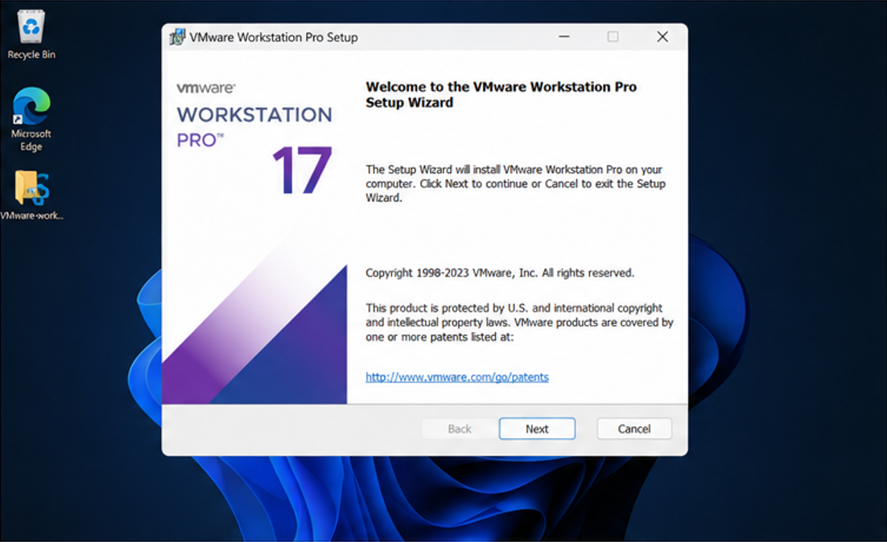
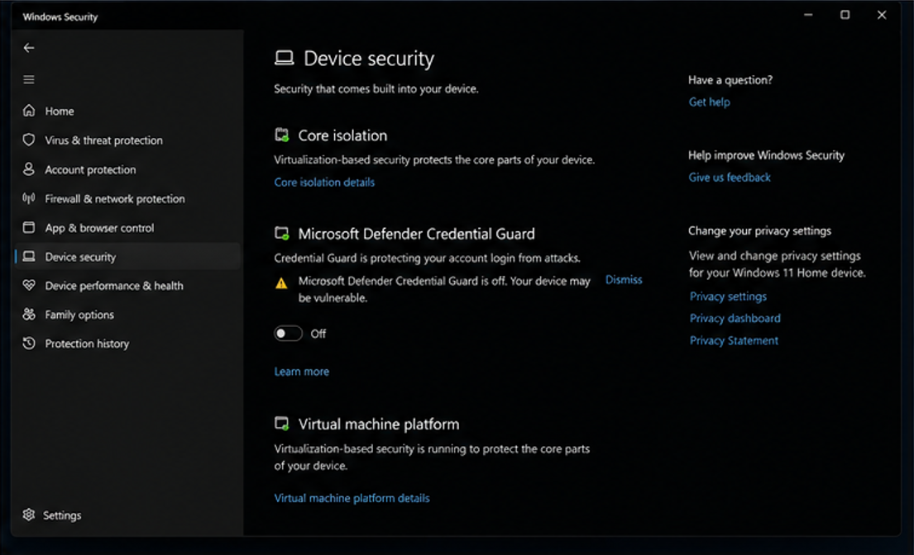
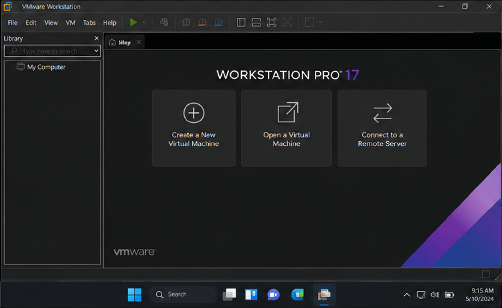
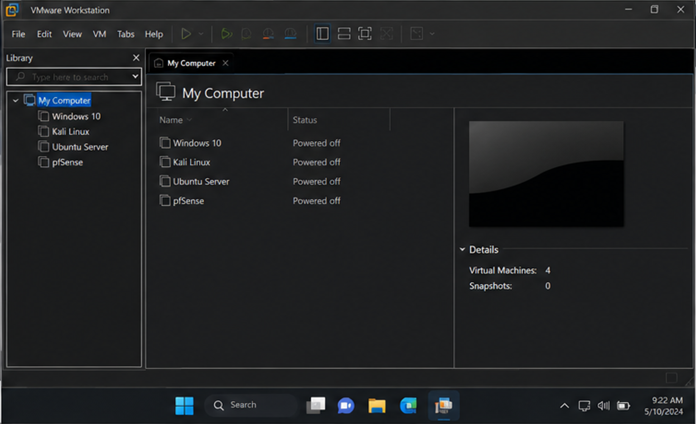
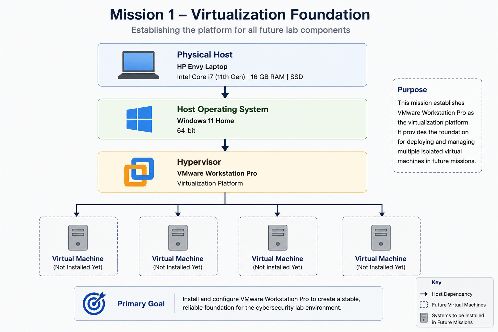

<!--
Mission README Template

Guidelines

- Place screenshots in /screenshots
- Place diagrams in /diagrams (if applicable)
- Present implementation in chronological order
- Use one screenshot per major step
- Explain why each step is performed
- Separate each major section with ---
- Keep screenshots close to the related text
- End with validation and next steps
- Keep implementation sections focused on one major task
-->

# Mission 1 – Installing a Hypervisor

## Objective

Install and configure VMware Workstation Pro to establish the virtualization platform that serves as the foundation of the Hupfen Security Lab.

---

## Technologies Used

- VMware Workstation Pro
- Windows 11 Home
- Intel VT-x Hardware Virtualization

---

## Environment

| Component | Configuration |
|-----------|---------------|
| Host System | HP Envy Laptop |
| Processor | Intel Core i7 (11th Generation) |
| Memory | 16 GB RAM |
| Host Operating System | Windows 11 Home |
| Hypervisor | VMware Workstation Pro |
| Primary Goal | Virtualization Platform |

---

## Mission Overview

This mission establishes the virtualization platform that supports every subsequent mission and project within the Hupfen Security Lab. Before deploying operating systems or security tools, a reliable hypervisor was required to host multiple isolated virtual machines while providing snapshot capabilities, flexible networking, and simplified system management.

During installation, Windows virtualization features interfered with VMware's native hypervisor. Resolving this conflict reinforced the importance of understanding how modern operating systems interact with hardware-assisted virtualization. With VMware successfully installed and validated, the environment was ready for Windows and Linux virtual machine deployment.

---

## Security Concepts Demonstrated

- Virtualization
- Lab Architecture
- System Preparation
- Baseline Configuration
- Infrastructure Planning

---

## Objectives Completed

- Installed VMware Workstation Pro
- Verified hardware virtualization support
- Resolved Windows hypervisor conflicts
- Validated successful virtual machine operation
- Established the virtualization foundation for the lab

---

## Skills Demonstrated

- Virtualization
- Hypervisor Installation
- Windows Administration
- Troubleshooting
- Technical Documentation

---

## Validation

Validation included:

- Confirming Intel VT-x hardware virtualization support
- Verifying VMware Workstation Pro installed successfully
- Resolving Windows virtualization conflicts
- Confirming VMware launched without errors
- Preparing the platform for virtual machine deployment

---

## Implementation

### Installing VMware Workstation Pro

VMware Workstation Pro was installed to provide the virtualization platform used throughout the Hupfen Security Lab. Snapshot support, virtual networking, and isolated virtual machines provide the flexibility required for future cybersecurity exercises.

---

### Resolving Hypervisor Conflicts

Windows virtualization features initially conflicted with VMware's native hypervisor. Identifying and resolving these conflicts ensured VMware could successfully access the system's hardware virtualization capabilities.

---

### Validating the Installation

After installation, VMware Workstation Pro was launched successfully and verified to be operating correctly. Confirming the virtualization platform before deploying virtual machines established a stable foundation for future missions.

---

### Preparing the Lab Environment

With VMware fully operational, the host system was prepared to support Windows and Linux virtual machines used throughout the remainder of the Hupfen Security Lab.

---

### Virtualization Architecture

With VMware Workstation Pro successfully installed, the host system was capable of supporting multiple isolated virtual machines. This virtualization layer became the foundation for every Windows, Linus, and networking component deployed throughout the remainder of the Hupfen Security Lab.

## Lessons Learned

- Virtualization platforms depend on hardware-assisted virtualization features being enabled and accessible
- Windows security features can interfere with third-party hypervisors if not configured appropriately
- Validating infrastructure before building additional systems reduces future troubleshooting
- A stable virtualization platform forms the foundation of an effective security lab

---

## Next Mission

Completion of this mission prepares the lab for:

- Windows workstation deployment
- Linux server deployment
- Virtual network design
- Future cybersecurity projects

## Related Blog Article

**Mission 1 - Installing a Hypervisor**

[Read the article at Hupfen Dynamics](https://hupfendynamics.com/blog/f/mission-1---installing-a-hypervisor)