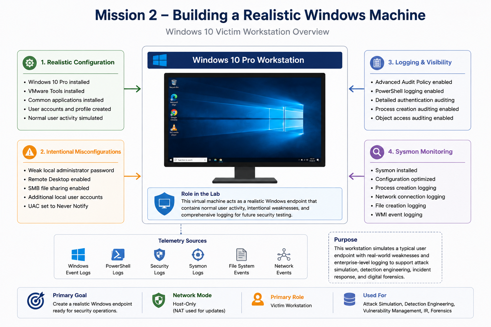
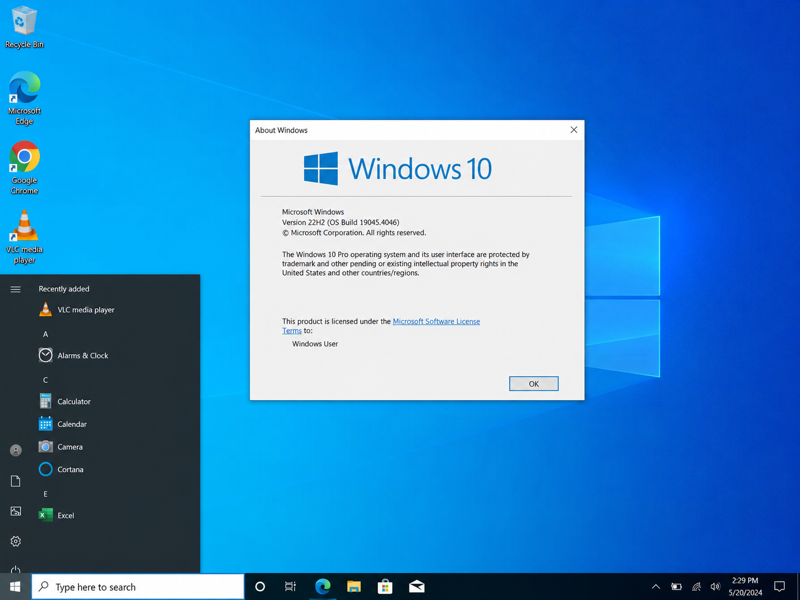
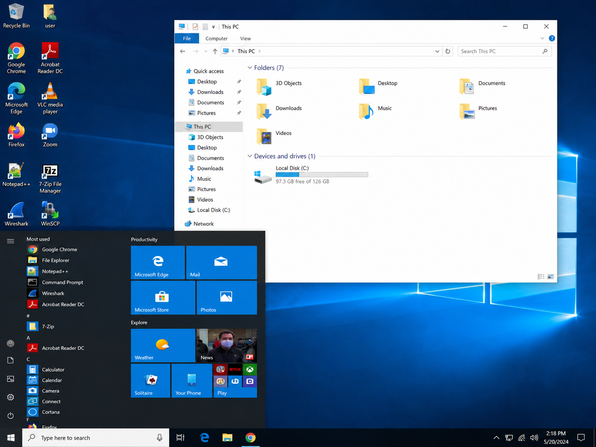
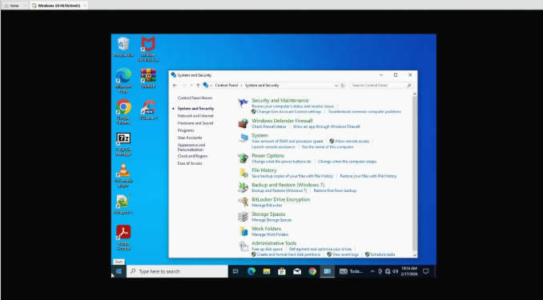

# Mission 2 – Building a Realistic Windows Machine

## Objective

Build and configure a Windows 10 Pro virtual machine that serves as a realistic endpoint for future attack simulation, detection engineering, vulnerability management, digital forensics, and incident response activities within the Hupfen Security Lab.

---

## Technologies Used

- VMware Workstation Pro
- Windows 10 Pro
- VMware Tools
- Sysmon
- Windows PowerShell
- Advanced Audit Policy
- Local Group Policy
- Windows Event Viewer

---

## Environment

| Component | Configuration |
|-----------|---------------|
| Hypervisor | VMware Workstation Pro |
| Operating System | Windows 10 Pro |
| Network Mode | Host-Only (temporarily switched to NAT for updates and software installation) |
| Primary Goal | Realistic Windows workstation for future security operations |

---

## Mission Overview

This mission established the first endpoint within the Hupfen Security Lab by creating a Windows 10 Pro workstation that closely resembles a real user's computer. Rather than deploying a clean operating system alone, realistic software, user activity, and system artifacts were intentionally created to more closely simulate an enterprise workstation.

After the operating system was configured, controlled weaknesses were introduced to support future attack simulations and security assessments. Finally, comprehensive Windows logging was enabled through PowerShell logging, Advanced Audit Policy, and Sysmon to ensure future offensive activity would generate meaningful telemetry for detection engineering, incident response, and forensic investigations.

---

## Security Concepts Demonstrated

- Endpoint Hardening
- Endpoint Visibility
- Security Telemetry
- Windows Auditing
- Sysmon Monitoring
- Intentional Misconfiguration
- Digital Forensics Readiness
- Detection Engineering Preparation

---

## Objectives Completed

- Installed Windows 10 Pro
- Installed VMware Tools
- Created realistic workstation activity
- Introduced controlled security weaknesses
- Configured Windows PowerShell logging
- Enabled Advanced Audit Policy
- Installed and validated Sysmon
- Created a reusable Windows security testing platform

---

## Skills Demonstrated

- Windows Administration
- Virtual Machine Deployment
- Windows Logging
- Sysmon Configuration
- PowerShell Administration
- Endpoint Security
- Security Monitoring
- Technical Documentation

---

## Validation

Validation included:

- Confirming Windows installed successfully
- Verifying VMware Tools functionality
- Confirming intentional configuration changes
- Verifying Windows audit events
- Confirming Sysmon operational logging
- Confirming the workstation was prepared for future attack simulations

---

## Implementation

### Installing Windows 10 Pro

The Windows virtual machine was deployed and configured as the first endpoint within the Hupfen Security Lab. VMware Tools were installed to improve virtual hardware integration and overall usability before additional security configuration began.

---

### Creating a Realistic Workstation

Applications, user activity, and normal workstation artifacts were created to make the virtual machine resemble a typical enterprise endpoint. Establishing realistic baseline activity provides better context for future investigations and detection engineering exercises.

---

### Introducing Controlled Misconfigurations

Several intentional weaknesses were configured, including weak credentials, Remote Desktop access, SMB sharing, and additional local user accounts. These controlled misconfigurations create realistic attack paths while remaining isolated inside the lab environment.

---

### Configuring Windows Security Logging

Windows logging was expanded by enabling Advanced Audit Policy, PowerShell logging, and Sysmon. Together, these telemetry sources provide detailed visibility into authentication events, process creation, PowerShell activity, and other system behavior required for future security monitoring.

---

### Validating Sysmon Telemetry

Sysmon operational logs were reviewed to confirm successful installation and verify that endpoint telemetry was being generated correctly. This validation ensured that future detections would have access to detailed endpoint events beyond the default Windows Security log.

---

## Lessons Learned

- Building realistic endpoints improves future security testing
- Logging should be configured before conducting attack simulations
- Sysmon significantly expands Windows endpoint visibility
- Controlled weaknesses create repeatable attack scenarios without introducing production risk

---

## Next Mission

Completion of this mission prepares the lab for:

- Linux Server deployment
- Centralized logging
- Vulnerability management
- Detection engineering
- Attack simulation
- Incident response

---

## Related Blog Article

**Mission 2 – Building a Realistic Windows Machine**

https://hupfendynamics.com/blog/f/mission-20-%E2%80%93-building-a-windows-victim-machine?blogcategory=Missions