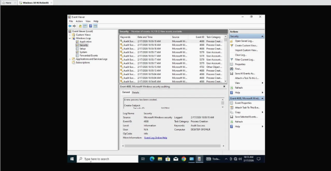
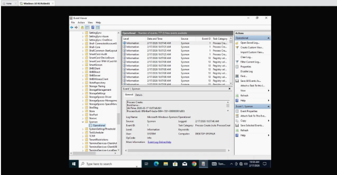

# Mission 2 – Building a Realistic Windows Machine

Build and prepare a Windows 10 Pro virtual machine that serves as a realistic victim workstation for future security testing, detection engineering, and incident response exercises.

---

## Objective

Design and configure a Windows 10 Pro virtual machine that closely resembles a typical workstation while intentionally introducing realistic weaknesses and enabling comprehensive security logging for future offensive and defensive exercises.

---

## Technologies Used

- VMware Workstation Pro
- Windows 10 Pro
- VMware Tools
- Windows PowerShell
- Windows Advanced Audit Policy
- Sysmon
- Local Group Policy
- Windows Event Viewer

---

## Environment

| Component | Configuration |
|-----------|---------------|
| Operating System | Windows 10 Pro |
| Hypervisor | VMware Workstation Pro |
| Network Mode | Host-Only, temporarily switched to NAT for updates and software installation |
| Primary Role | Victim Workstation |

---

## Project Summary

This mission focused on creating the first endpoint within the Hupfen Security Lab.

Rather than simply installing Windows, the objective was to build a workstation that resembles a real user's computer. Common applications were installed, normal browsing activity was simulated, and user artifacts were intentionally created to provide realistic evidence for future investigations.

Once the system had been established, controlled misconfigurations were introduced, including weak credentials, Remote Desktop configuration, SMB file sharing, and additional local accounts. These changes create the types of weaknesses commonly encountered during security assessments without exposing production systems to unnecessary risk.

Before any future attack simulations, visibility was enabled through PowerShell logging, Advanced Audit Policy, and Sysmon. This ensures that later offensive exercises generate meaningful telemetry for detection engineering, incident response, and forensic analysis.

---

## Security Concepts Demonstrated

- Realistic Endpoint Design
- Intentional Misconfiguration
- Endpoint Visibility
- Telemetry Collection
- Attack Simulation Readiness
- Digital Forensics Readiness

---

## Implemented Controls

- Windows 10 Pro virtual machine created
- VMware Tools installed
- Baseline snapshot created
- Standard user activity simulated
- Intentional weaknesses introduced
- PowerShell Logging enabled
- Advanced Audit Policy configured
- Sysmon installed

---

## Skills Demonstrated

- Windows Administration
- Virtual Machine Deployment
- Intentional Misconfiguration
- PowerShell Logging
- Windows Advanced Audit Policy
- Sysmon Deployment
- Security Monitoring
- Detection Engineering Fundamentals
- Technical Documentation

---

## Key Takeaways

- Designed a realistic Windows victim workstation.
- Created believable user activity and system artifacts.
- Introduced controlled security weaknesses for future attack simulations.
- Enabled enterprise-style logging before conducting offensive testing.
- Established a reusable baseline for future detection engineering exercises.

---

## Implementation Screenshots

### Creating Intentional Misconfigurations

---

### Event Logging

---

### Sysmon Logging

---

## Future Use

This workstation serves as the realistic Windows endpoint used for future attack simulation, vulnerability management, detection engineering, and incident response exercises.

---

## Related Blog Article

**Mission 2 – Building a Realistic Windows Machine**

https://hupfendynamics.com/blog/f/mission-20-%E2%80%93-building-a-windows-victim-machine?blogcategory=Missions