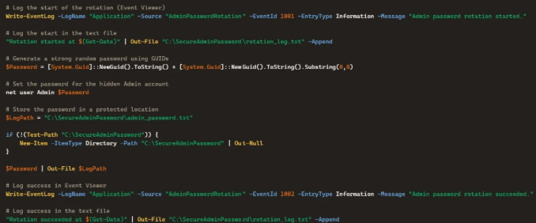
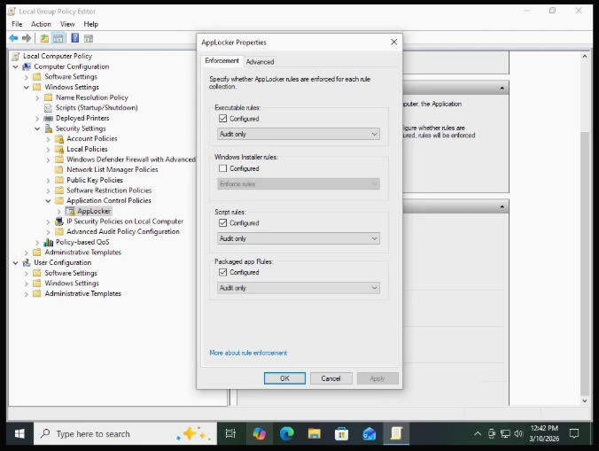

# Mission 2.5 – Building a Secure Windows Workstation

Design and harden a Windows 10 Pro workstation that demonstrates enterprise security practices, layered defenses, and comprehensive endpoint visibility.

---

## Objective

Build a Windows workstation that reflects the security controls commonly found in well-managed enterprise environments while balancing security, usability, and operational effectiveness.

---

## Technologies Used

- VMware Workstation Pro
- Windows 10 Pro
- Windows Defender
- Microsoft Defender Attack Surface Reduction (ASR)
- AppLocker
- Microsoft SmartScreen
- Controlled Folder Access
- Sysmon
- Windows Advanced Audit Policy
- PowerShell Logging
- Windows Event Viewer
- Local Group Policy

---

## Environment

| Component | Configuration |
|-----------|---------------|
| Operating System | Windows 10 Pro |
| Hypervisor | VMware Workstation Pro |
| Network | Management Network |
| Primary Role | Hardened Administrative Workstation |

---

## Project Summary

This mission focused on building a Windows workstation that follows enterprise security best practices while remaining practical for everyday use.

Rather than relying on a single defensive product, the workstation was designed around layered security controls. Administrative privileges were separated from normal user activity, Windows security features were enabled, endpoint protections were strengthened, and comprehensive logging was configured before any future attack simulations.

The workstation was also configured to generate high-quality telemetry through Sysmon, PowerShell logging, Advanced Audit Policy, and expanded Windows Event Logging. These controls provide the visibility necessary for future detection engineering, forensic analysis, and incident response exercises.

Finally, realistic user activity was introduced to ensure the workstation produces the artifacts investigators expect to encounter during security investigations.

---

## Security Concepts Demonstrated

- Defense in Depth
- Least Privilege
- Secure Configuration Management
- Endpoint Hardening
- Telemetry Collection
- Administrative Separation

---

## Skills Demonstrated

- Windows Administration
- Windows Security Hardening
- Endpoint Security
- Defense in Depth
- Privileged Access Management
- Microsoft Defender Configuration
- AppLocker
- PowerShell Logging
- Sysmon Deployment
- Windows Advanced Audit Policy
- Security Monitoring
- Detection Engineering Fundamentals
- Technical Documentation

---

## Key Takeaways

- Built a secure Windows enterprise workstation.
- Applied layered endpoint security controls.
- Separated administrative and standard user responsibilities.
- Configured comprehensive endpoint logging.
- Established a secure baseline for future attack simulations.
- Created realistic user activity for future forensic investigations.

---

## Implementation Screenshots

### Creating the Initial User

The initial user account establishes the administrative foundation of the workstation before additional security controls are introduced.

---

### Creating the ITAdmin Account

Rather than performing everyday work with elevated privileges, a dedicated admin account is created for system administrative tasks. This separation helps reduce unnecessary exposure of privileged credentials and aligns with the principle of least privilege.

---

### Administrative Password Rotation

Administrative tasks can often be automated to improve both consistency and accountablility. This PowerShell script demonstrates automated local administrator password rotation while recording activity in the Windows Event Log for auditing purposes.

---

### Windows Event Viewer

Windows Event Viewer provides the visibility needed to monitor authentication events, system activity, and security-related changes. Establishing comprehensive logging before conducting security testing ensures evidence for future investigations.

---

### Local Group Policy

Local Group Policy was used to configure security settings that strengthen the workstation while maintaining usability. Applying policy-based controls establishes a consistent security baseline and supports enterprise-style endpoint management.

---

## Related Blog Article

**Mission 2.5 – Building a Secure Windows Workstation**

https://hupfendynamics.com/blog/f/mission-25---building-a-secure-windows-workstation
