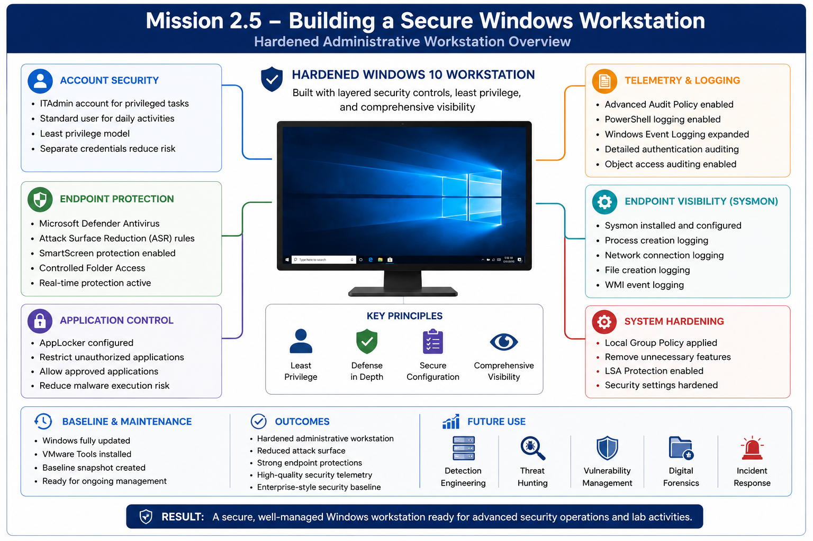
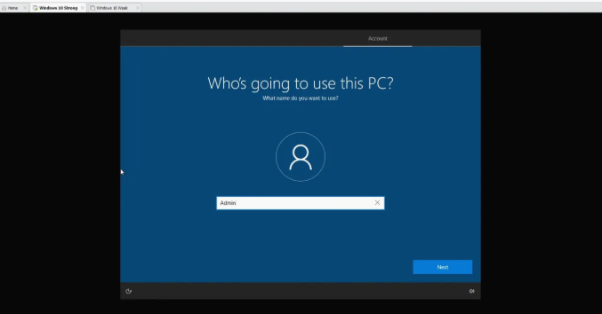
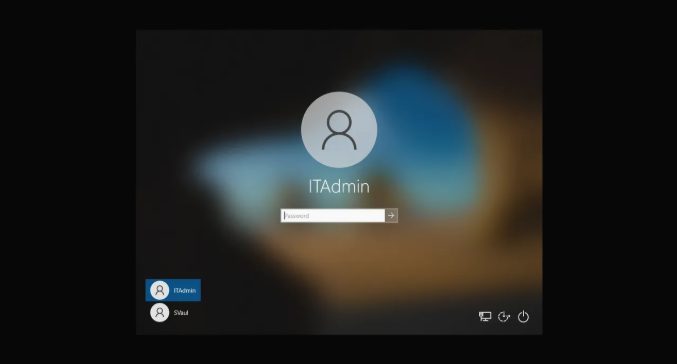
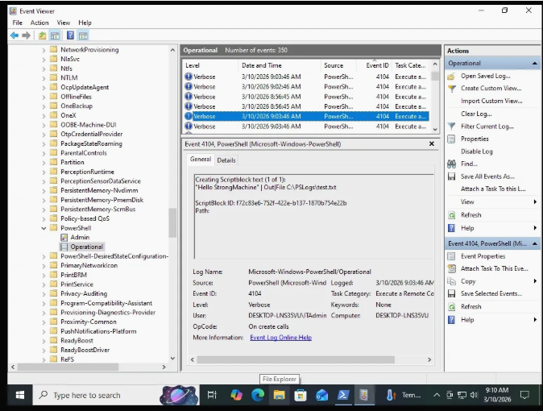

# Mission 2.5 – Building a Secure Windows Workstation

## Objective

Build and harden a Windows 10 Pro workstation that demonstrates enterprise security best practices through layered endpoint protections, least privilege, comprehensive auditing, and realistic administrative workflows within the Hupfen Security Lab.

---

## Technologies Used

- Advanced Audit Policy
- AppLocker
- Microsoft Defender
- Microsoft Defender Attack Surface Reduction (ASR)
- Sysmon
- VMware Workstation Pro
- Windows 10 Pro
- Windows PowerShell

---

## Environment

| Component | Configuration |
|-----------|---------------|
| Hypervisor | VMware Workstation Pro |
| Operating System | Windows 10 Pro |
| Network | Management Network |
| Primary Goal | Hardened administrative workstation for security operations |

---

## Mission Overview

This mission transformed the standard Windows workstation created during Mission 2 into a hardened administrative endpoint modeled after enterprise security practices. Rather than relying on a single defensive product, multiple layers of protection were configured to reduce attack surface while improving endpoint visibility.

Administrative privileges were separated from everyday user activity, Windows security features were strengthened, and detailed logging was enabled before future attack simulations. Together, these controls establish a secure baseline that supports detection engineering, incident response, digital forensics, and vulnerability management throughout the remainder of the lab.

---

## Security Concepts Demonstrated

- Defense in Depth
- Least Privilege
- Endpoint Hardening
- Security Monitoring
- Administrative Separation
- Attack Surface Reduction
- Endpoint Visibility
- Security Baselining

---

## Objectives Completed

- Hardened the Windows workstation
- Created dedicated administrative and standard user accounts
- Configured Microsoft Defender security features
- Enabled comprehensive Windows auditing
- Installed and validated Sysmon
- Applied Group Policy security settings
- Reduced endpoint attack surface
- Established a reusable hardened workstation baseline

---

## Skills Demonstrated

- Windows Administration
- Endpoint Hardening
- Microsoft Defender Configuration
- AppLocker Administration
- Windows Logging
- Sysmon Configuration
- Group Policy Management
- Security Documentation

---

## Validation

Validation included:

- Confirming administrative account separation
- Verifying Microsoft Defender protections
- Validating Windows audit events
- Confirming Sysmon telemetry generation
- Verifying Group Policy application
- Confirming workstation functionality after hardening

---

## Implementation

### Creating the Initial User

The workstation was initially configured with a standard user account that would later become the primary non-administrative account. Separating administrative and everyday activities establishes the foundation for applying the principle of least privilege.

---

### Creating a Dedicated Administrative Account

A dedicated IT administrator account was created for privileged system administration. Performing administrative tasks through a separate account reduces unnecessary exposure of elevated credentials and reflects common enterprise security practices.

---

### Automating Administrative Password Management

Administrative password rotation was automated using PowerShell to improve consistency and accountability. Automating privileged account management reduces administrative overhead while generating useful security events for future monitoring.

---

### Configuring Windows Security Logging

Windows Event Viewer, Advanced Audit Policy, PowerShell logging, and Sysmon were configured to provide detailed endpoint telemetry. Establishing comprehensive logging before conducting attack simulations ensures that future investigations have the evidence necessary for detection engineering and forensic analysis.

---

### Applying Local Security Policies

Local Group Policy was used to configure security settings including endpoint protections, administrative restrictions, and additional hardening measures. Applying policy-based controls creates a consistent security baseline that closely resembles enterprise workstation management.

---

## Supporting Scripts

PowerShell scripts used throughout this mission are located in the `scripts` directory.

These scripts automate administrative tasks, demonstrate Windows security concepts, and support the workstation hardening process documented in this mission.

---

## Lessons Learned

- Layered security controls provide stronger protection than any individual technology
- Administrative account separation reduces unnecessary privilege exposure
- Security logging should be configured before conducting security testing
- Enterprise hardening improves both security visibility and future detection capabilities

---

## Next Mission

Completion of this mission prepares the lab for:

- Linux server deployment
- Centralized logging
- Vulnerability management
- Detection engineering
- Attack simulation
- Incident response

---

## Related Blog Article

**Mission 2.5 – Building a Secure Windows Workstation**

[Read the article at Hupfen Dynamics](https://hupfendynamics.com/blog/f/mission-25-building-a-strong-windows-machine)