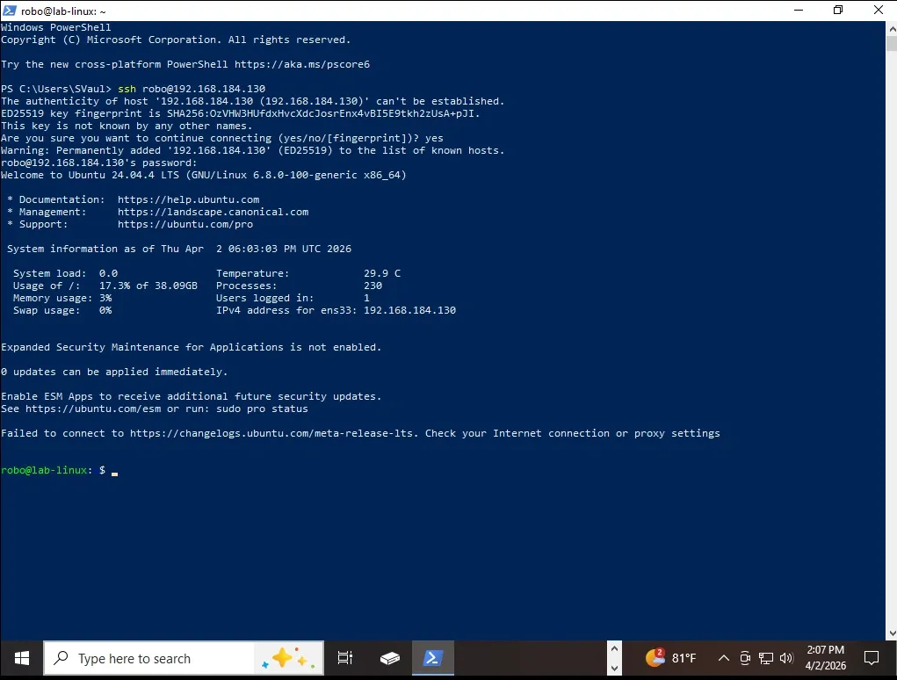
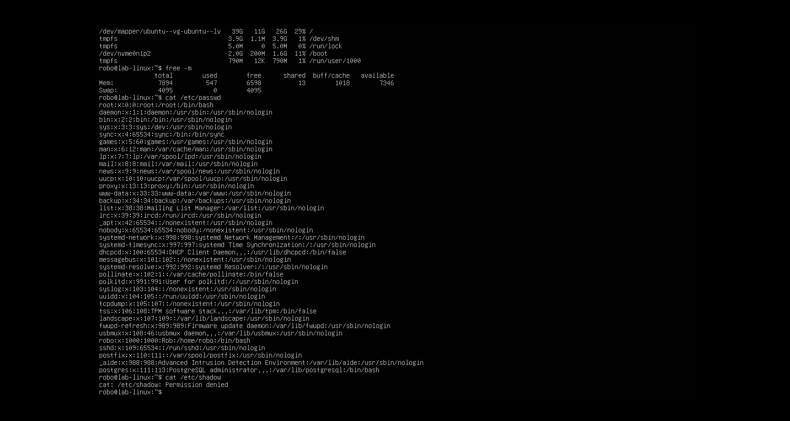

# Mission 3 – Building a Linux VM Server

## Objective

Build and harden an Ubuntu Server that serves as the foundation for centralized logging, security tooling, forensic analysis, vulnerability management, and future detection engineering projects.

---

## Technologies Used

- Ubuntu Server 24.04 LTS
- VMware Workstation Pro
- OpenSSH
- auditd
- journald
- AIDE
- OpenSSL
- Bash
- Linux Systemd
- apt Package Manager

---

## Environment

| Component | Configuration |
|-----------|---------------|
| Operating System | Ubuntu Server 24.04 LTS |
| Hypervisor | VMware Workstation Pro |
| Network | Management Network |
| Primary Role | Security Infrastructure Server |

---

## Project Summary

This mission introduced the first Linux server into the Hupfen Security Lab.

Rather than deploying Linux as another standalone virtual machine, the server was designed to become the central platform supporting future security operations. It provides the foundation for centralized logging, security tooling, forensic investigations, vulnerability management, and detection engineering.

The server was configured with secure remote administration through OpenSSH, comprehensive auditing with auditd, persistent logging through journald, and file integrity monitoring using AIDE. Baseline validation and system snapshots were performed before additional projects were introduced to ensure future changes could be measured against a trusted configuration.

---

## Security Concepts Demonstrated

- Security by Design
- Linux System Administration
- Secure Remote Administration
- Defense in Depth
- System Hardening
- Audit Logging
- File Integrity Monitoring
- Baseline Validation
- Change Detection
- Detection Readiness

---

## Implemented Controls

- Ubuntu Server installed
- OpenSSH configured
- Remote administration validated
- System fully updated
- Baseline snapshot captured
- auditd configured
- journald persistence enabled
- AIDE initialized
- System baseline documented
- Administrative activity validated

---

## Skills Demonstrated

- Linux Administration
- SSH Administration
- Bash
- System Hardening
- auditd
- journald
- AIDE
- File Integrity Monitoring
- Security Monitoring
- Detection Engineering Fundamentals
- Technical Documentation

---

## Key Takeaways

- Built a secure Linux server for enterprise-style security operations.
- Established centralized logging and auditing capabilities.
- Implemented file integrity monitoring.
- Created a trusted system baseline.
- Prepared the platform for future vulnerability management, detection engineering, and incident response projects.

---

## Validation

After configuration, the server was validated to confirm security controls functioned as expected.

Validation included:

- SSH connectivity
- auditd event generation
- journald persistence
- AIDE initialization
- User privilege separation
- Baseline integrity verification

---

## Implementation Highlights

### Ubuntu Profile Configuration

The initial Ubuntu profile configuration establishes the server identity, primary user account, and hostname used throughout the environment.

---

### Remote SSH Administration

OpenSSH allows the Linux server to be administered remotely from another workstation, reflecting how Linux servers are commonly managed in enterprise environments.

---

### Initial System Validation

Basic validation confirms system resources, user configuration, and privilege boundaries before additional security controls are introduced.

---

### Authentication and System Logging

Linux distributes security telemetry across multiple logging components. Reviewing authentication, sudo, and system events confirms that meaningful telemetry is being collected.

---

## Future Use

This server becomes the backbone of the remaining Hupfen Security Lab.

Future projects include:

- Splunk SIEM
- Centralized Log Management
- Vulnerability Management
- PCI DSS Compliance
- Detection Engineering
- Digital Forensics
- Incident Response

---

## Related Blog Article

**Mission 3 – Building a Linux VM Server**

https://hupfendynamics.com/blog/f/mission-3-building-a-linux-vm-server?blogcategory=Missions
