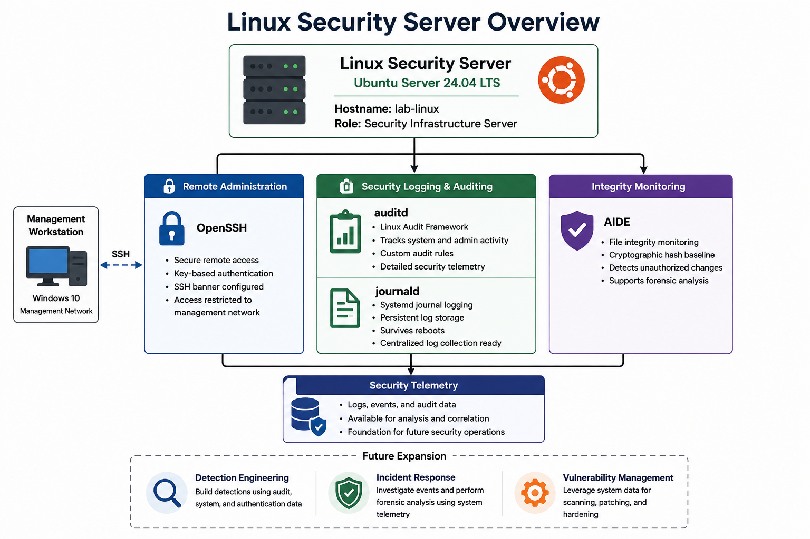
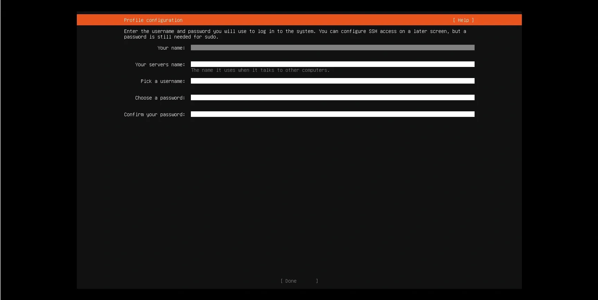
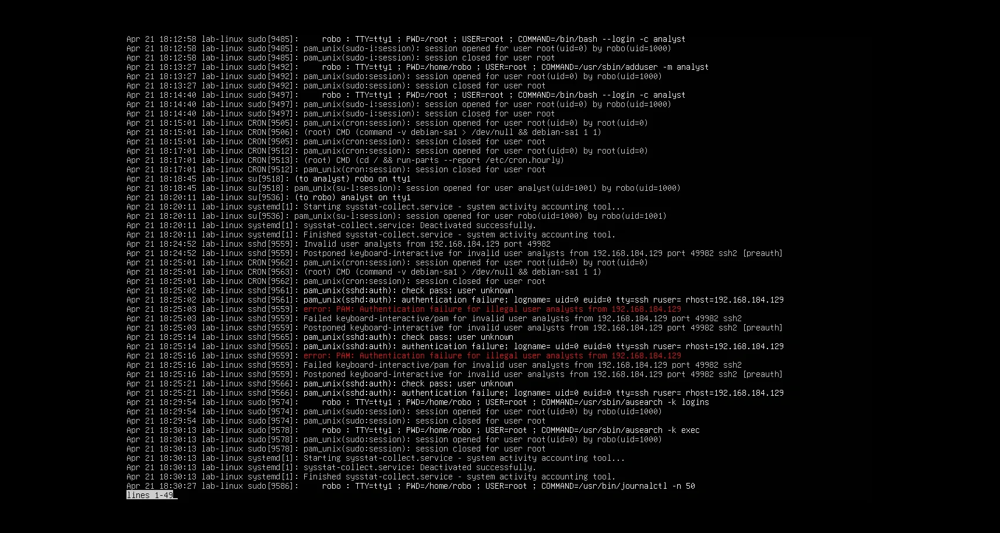
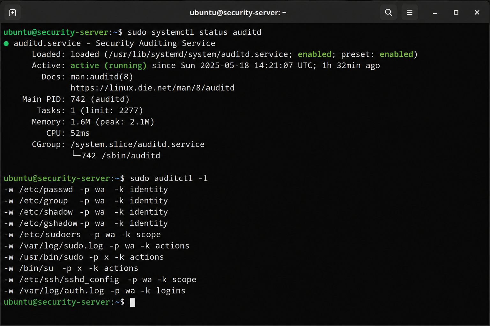
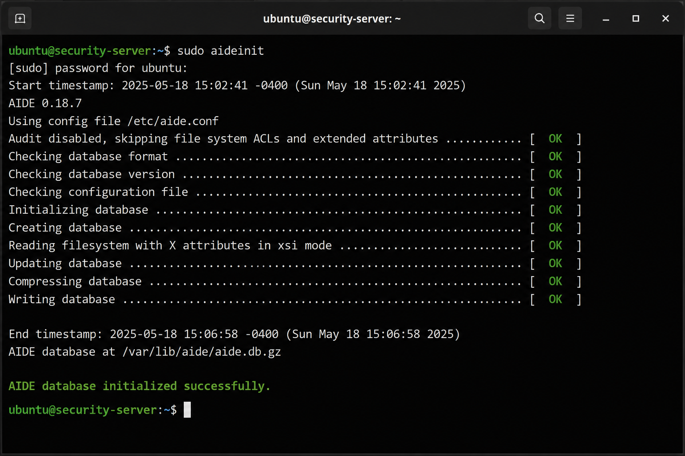

# Mission 3 – Building a Linux VM Server

## Objective

Build and harden an Ubuntu Server that serves as the foundation for centralized logging, security tooling, forensic analysis, vulnerability management, and future detection engineering projects within the Hupfen Security Lab.

---

## Technologies Used

- AIDE
- apt
- auditd
- Bash
- journald
- OpenSSH
- OpenSSL
- systemd
- Ubuntu Server 24.04 LTS
- VMware Workstation Pro

---

## Environment

| Component | Configuration |
|-----------|---------------|
| Hypervisor | VMware Workstation Pro |
| Operating System | Ubuntu Server 24.04 LTS |
| Network | Management Network |
| Primary Goal | Security infrastructure server for centralized logging and future security operations |

---

## Mission Overview

This mission introduced the first Linux server into the Hupfen Security Lab and established a central platform for future security operations. Rather than deploying Linux as a standalone virtual machine, the server was designed to support centralized logging, security tooling, forensic analysis, vulnerability management, and detection engineering.

Secure remote administration was configured through OpenSSH, system auditing was enabled with auditd, persistent logging was established through journald, and file integrity monitoring was implemented using AIDE. Baseline validation and system snapshots were completed before additional projects were introduced so future changes could be measured against a trusted baseline.

---

---

## Security Concepts Demonstrated

- Security by Design
- Linux System Administration
- Secure Remote Administration
- Defense in Depth
- System Hardening
- Audit Logging
- File Integrity Monitoring
- Baseline Validation
- Change Detection
- Detection Readiness

---

## Objectives Completed

- Installed Ubuntu Server 24.04 LTS
- Configured OpenSSH
- Validated remote administration
- Updated the operating system
- Captured a baseline snapshot
- Configured auditd
- Enabled persistent journald logging
- Initialized AIDE
- Documented the system baseline
- Validated administrative activity

---

## Skills Demonstrated

- Linux Administration
- SSH Administration
- Bash
- System Hardening
- auditd Configuration
- journald Configuration
- AIDE Administration
- File Integrity Monitoring
- Security Monitoring
- Technical Documentation

---

## Validation

Validation included:

- Confirming SSH connectivity
- Verifying remote administrative access
- Confirming auditd event generation
- Verifying persistent journald logging
- Confirming AIDE initialization
- Validating user privilege separation
- Verifying the trusted system baseline was established

---

## Implementation

### Configuring the Ubuntu Server Profile

The initial Ubuntu profile configuration established the server hostname, primary user account, and system identity used throughout the lab. Defining these values during installation created a consistent baseline for future administration and logging.

---

### Enabling Remote SSH Administration

OpenSSH was configured to support secure remote administration from the Windows management workstation. This reflects how Linux servers are commonly managed in enterprise environments while reducing the need for direct console access.

---

### Validating the Initial System

System resources, user configuration, network connectivity, and privilege boundaries were reviewed before additional security controls were introduced. Establishing a known-good starting point reduced the risk of building future services on an unverified system.

---

### Configuring Persistent System Logging

Linux authentication, sudo activity, and system events were reviewed through journald to confirm that meaningful security telemetry was being collected. Persistent logging ensures that events survive system reboots and remain available for future investigations, centralized log collection, and detection engineering.

---

### Configuring Linux Audit Logging

The Linux Audit Framework (auditd) was configured to record security-relevant system activity beyond traditional authentication logs. Audit rules were validated to confirm that administrative actions and monitored events generated detailed telemetry suitable for future detection engineering and forensic investigations.

---

### Establishing File Integrity Monitoring

AIDE (Advanced Intrusion Detection Environment) was initialized to create a trusted baseline of critical system files. Future integrity checks can compare the current system against this baseline to identify unauthorized modifications or unexpected changes.

---

## Lessons Learned

- Linux security infrastructure should begin with a validated baseline
- Secure remote administration improves manageability without sacrificing control
- Audit and logging services should be configured before deploying additional security tools
- File integrity monitoring provides a reliable method for identifying unauthorized changes
- Persistent logs are essential for investigations that occur after a system restart

---

## Next Mission

Completion of this mission prepares the lab for:

- Splunk SIEM deployment
- Centralized log management
- Vulnerability management
- PCI DSS monitoring
- Detection engineering
- Digital forensics
- Incident response

---

## Related Blog Article

**Mission 3 – Building a Linux VM Server**

https://hupfendynamics.com/blog/f/mission-3-building-a-linux-vm-server?blogcategory=Missions