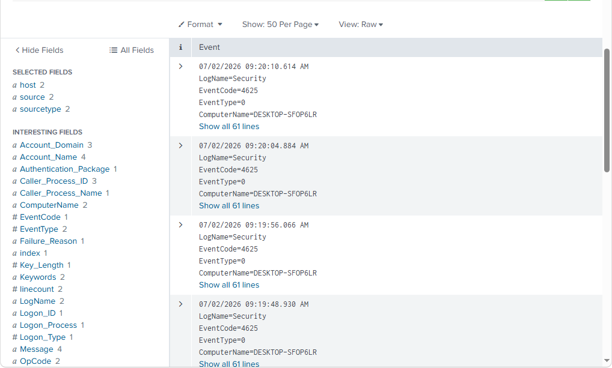
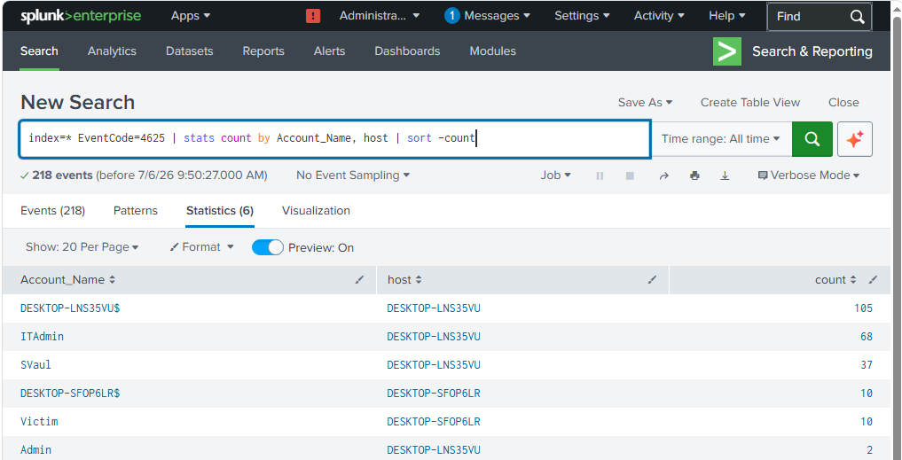
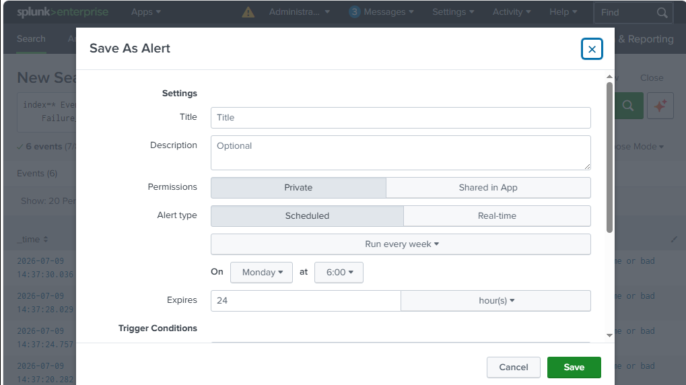
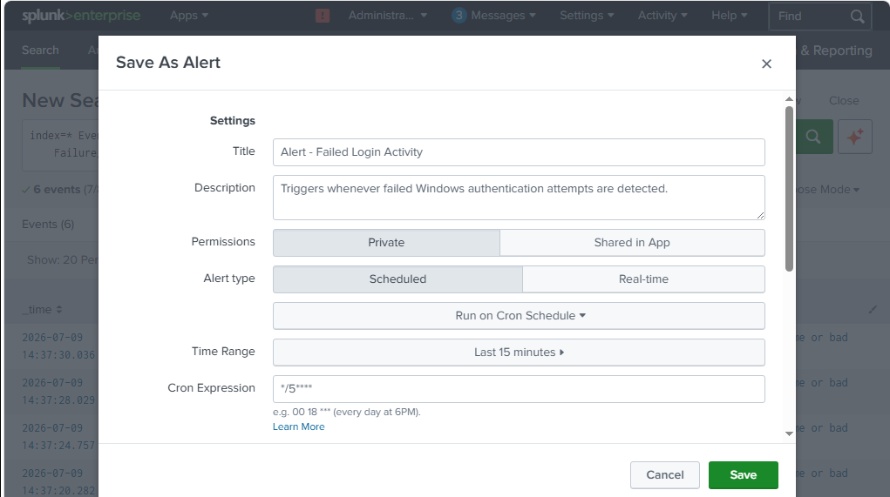
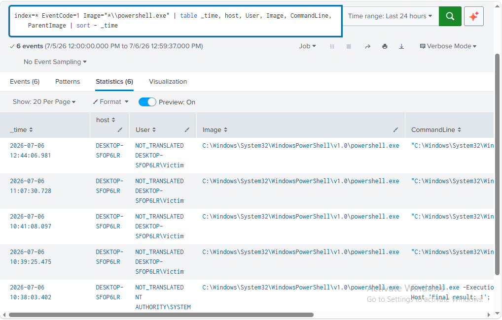
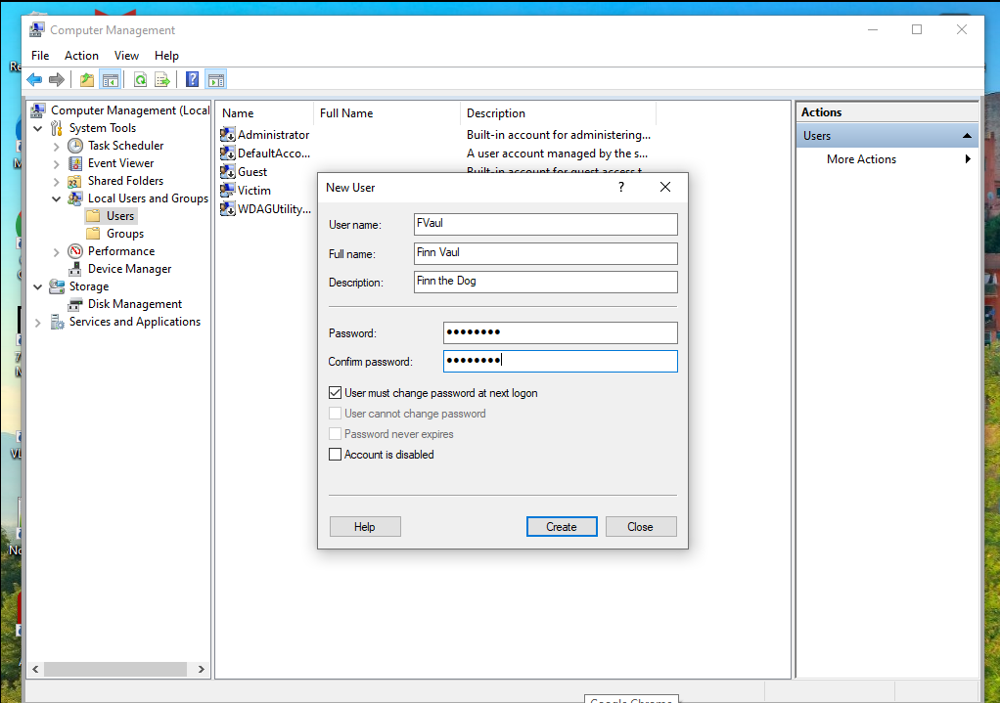
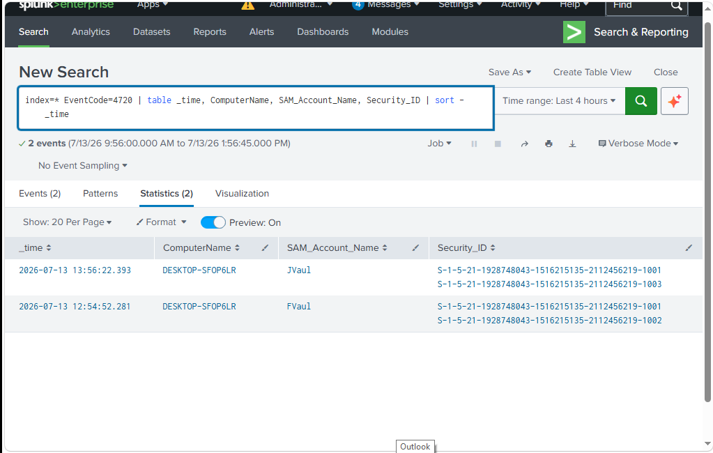
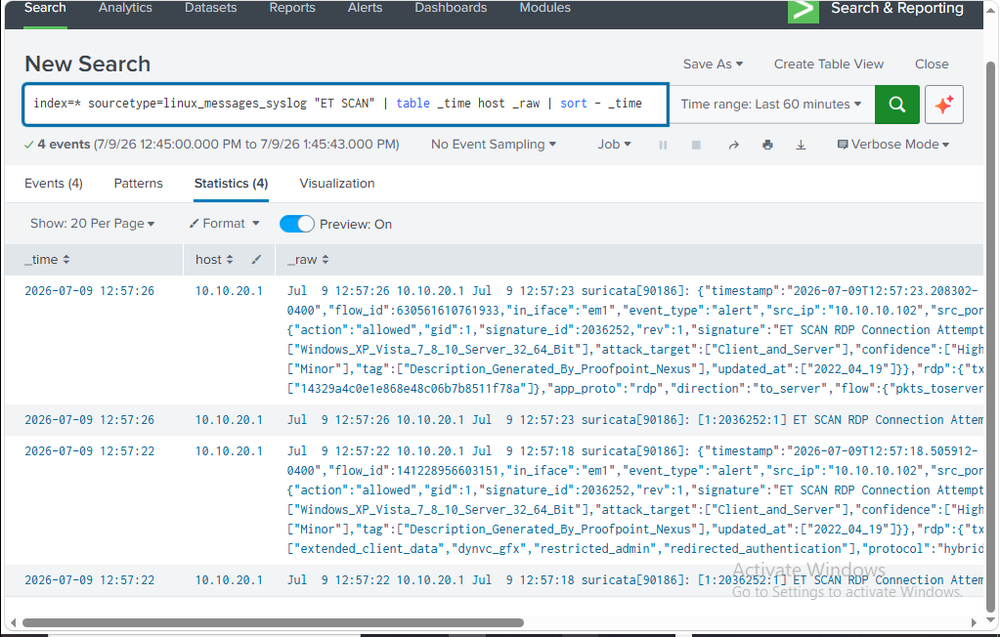
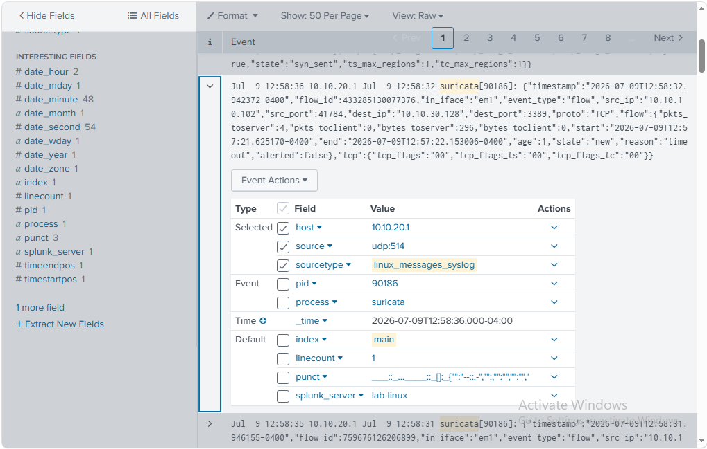

<!--
README Template

Guidelines

- Place screenshots in /screenshots
- Place diagrams in /diagrams
- Use one image per implementation step
- Keep Project Summary to 2–3 paragraphs
- Use sentence case for section descriptions
- Separate each major section with ---
- Keep Technologies Used limited to major technologies
- Future Use should focus on follow-on projects
-->

# Detection Engineering Program

## Objective

Design, build, validate, and document a library of security detections using Windows Event Logs, Sysmon, Suricata IDS, and Splunk. The project demonstrates the complete detection engineering lifecycle from search development through alert validation and operational documentation.

---

## Technologies Used

- Splunk Enterprise
- Windows Event Logs
- Sysmon
- Suricata IDS
- pfSense
- Ubuntu Server 24.04 LTS
- Kali Linux
- PowerShell

---

## Environment

| Component | Configuration |
|-----------|---------------|
| SIEM | Splunk Enterprise |
| Windows Endpoint | Windows 10 with Sysmon |
| Linux Server | Ubuntu Server 24.04 LTS |
| Firewall / IDS | pfSense with Suricata |
| Attack Workstation | Kali Linux |
| Primary Goal | Detection Engineering and Alert Validation |

---

## Project Summary

This project focused on developing practical security detections using multiple telemetry sources collected throughout the Hupfen Security Lab. Rather than relying on prebuilt detections, each search was developed, validated, documented, and converted into operational alerts using realistic attack simulations and administrative activity.

Detections were created for failed logins, PowerShell execution, Windows account creation, and network reconnaissance. Each detection was validated within Splunk using controlled test activity, producing a documented detection library that demonstrates the complete workflow from telemetry collection to analyst investigation.

---

## Security Concepts Demonstrated

- Detection Engineering
- SIEM Operations
- Windows Security Monitoring
- Sysmon Analysis
- Network Intrusion Detection
- Alert Development
- Detection Validation
- Threat Hunting
- MITRE ATT&CK Mapping

---

## Implemented Controls

- Created custom Splunk searches
- Built scheduled detection alerts
- Validated Windows Security Event detections
- Validated Sysmon process monitoring
- Detected Suricata network reconnaissance
- Verified alert generation through simulated activity
- Documented detection logic and validation procedures

---

## Skills Demonstrated

- Splunk SPL
- Detection Engineering
- Windows Event Analysis
- Sysmon Analysis
- Suricata IDS
- Alert Tuning
- Security Monitoring
- Threat Detection
- Technical Documentation

---

## Key Takeaways

- Developed multiple custom security detections from operational telemetry
- Validated detections using realistic administrative and attack activity
- Converted manual searches into repeatable automated alerts
- Built reusable detection documentation suitable for future expansion
- Established a foundation for ongoing detection engineering and threat hunting

---

## Validation

Validation included:

- Generating failed Windows authentication attempts
- Executing PowerShell activity
- Creating Windows user accounts
- Running network reconnaissance from Kali Linux
- Confirming detections in Splunk
- Validating scheduled alert execution

---

## Implementation Highlights

### Building the First Detection

The project began by developing a basic Splunk search to identify failed Windows authentication attempts. This initial query confirmed that Windows Security events were reaching Splunk and established the foundation for building additional detections throughout the project.

---

### Refining Detection Logic

After validating the initial search, the results were refined using SPL commands to organize authentication activity into a more useful format. Grouping events by account and host transformed raw log data into information that could be quickly analyzed during an investigation.

---

### Converting a Detection into an Alert

Once the failed login detection had been validated, it was converted into a scheduled Splunk alert. This transformed a manually executed search into an automated detection capable of notifying analysts whenever matching activity occurred.

---

### Configuring Alert Execution

The alert was configured with an appropriate execution schedule, search window, and trigger conditions to reliably detect failed authentication activity. Proper scheduling ensured that new events would be evaluated automatically while reducing unnecessary duplicate alerts.

---

### PowerShell Execution Detection

The next detection focused on monitoring PowerShell process creation through Sysmon telemetry. Capturing process execution events provides valuable visibility into administrative activity, automation, and techniques commonly used by attackers after gaining access to a system.

---

### Generating Test Activity

Before building a detection for new user account creation, controlled administrative activity was generated on the Windows endpoint. Creating known activity first ensured that the resulting Windows Security events could be identified, explored, and validated before developing the final detection.

---

### Validating Account Creation Detection

After the detection was completed, additional user accounts were created to confirm that new Windows Security Event ID 4720 records were successfully collected and identified by Splunk. Validation against known activity confirmed that the detection operated as expected.

---

### Network Reconnaissance Detection

Detection engineering extended beyond endpoint telemetry by incorporating Suricata intrusion detection alerts. Network reconnaissance generated from the Kali Linux attack workstation produced Suricata events that were indexed by Splunk and used to identify potential scanning activity.

---

### Investigating Alert Details

Expanding the Suricata event exposed the detailed network telemetry captured during the scan, including addresses, ports, signatures, classifications, and additional context useful during incident investigations. Reviewing the complete event demonstrates the value of combining network telemetry with SIEM-based detections.

---

## Future Use

This detection library supports future projects involving:

- Security Monitoring
- SOC Operations
- Threat Hunting
- Detection Tuning
- Incident Response
- Purple Team Exercises

---

## Related Blog Article

**Detection Engineering Project**

[Read the article at Hupfen Dynamics](https://hupfendynamics.com/blog/f/designing-and-building-a-detection-engineering-program)