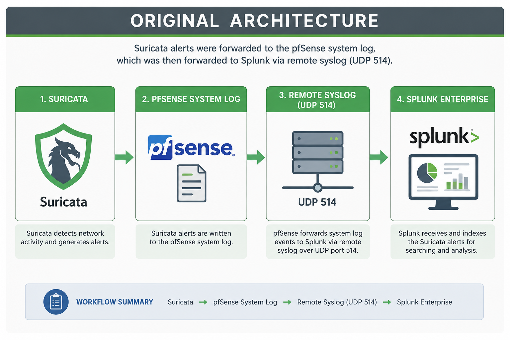
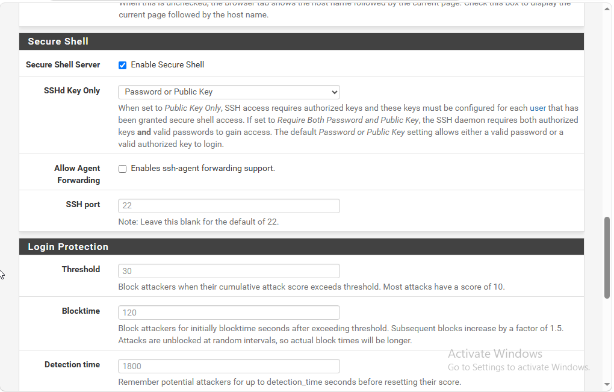
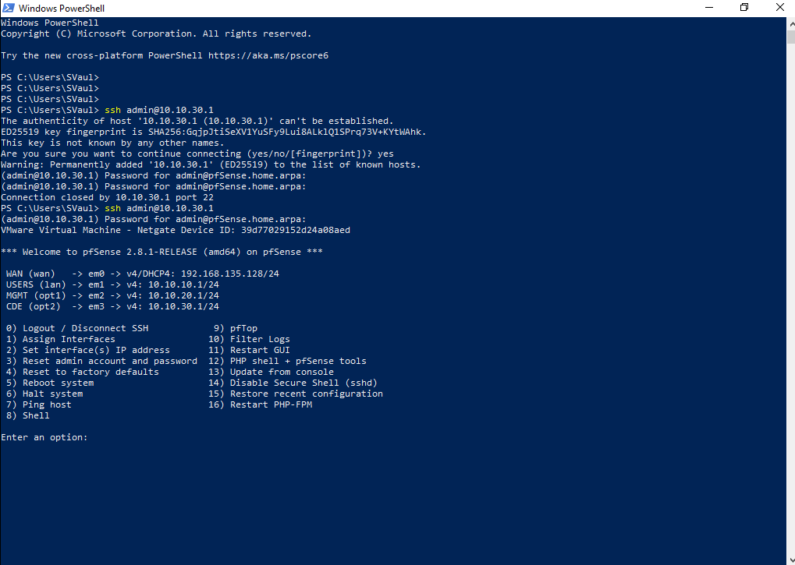
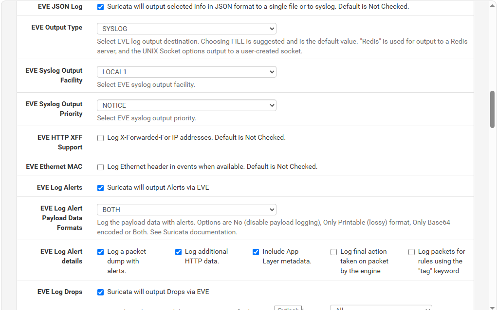
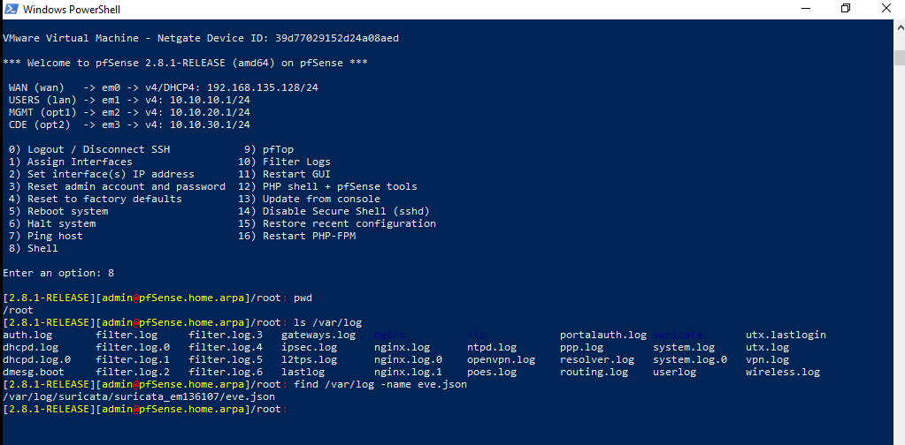
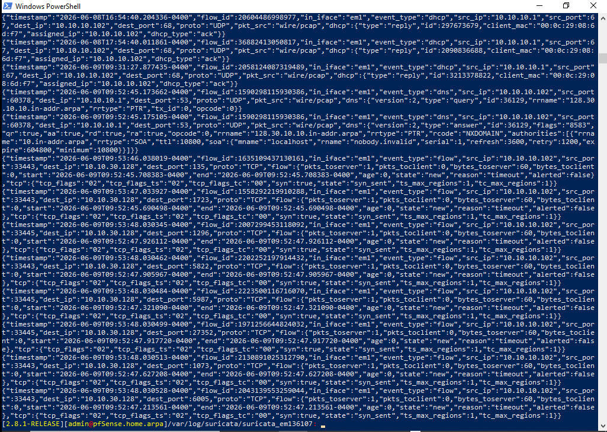
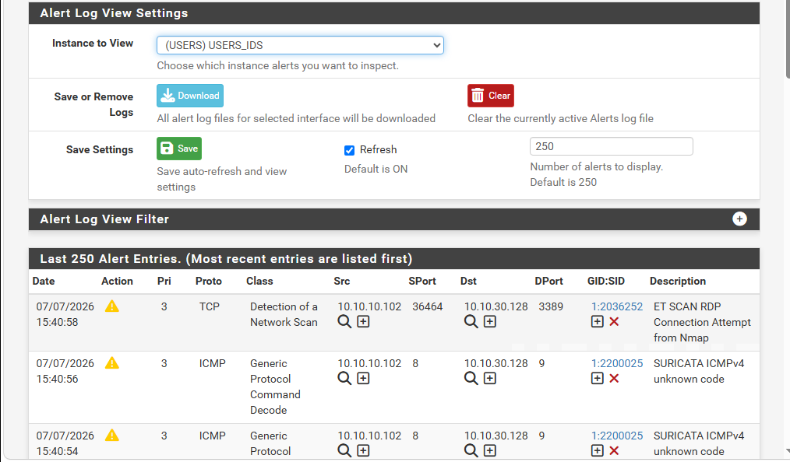
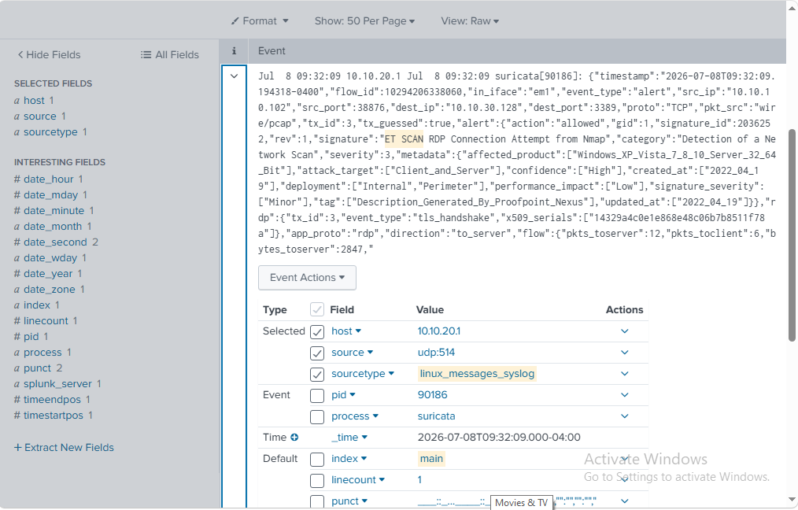
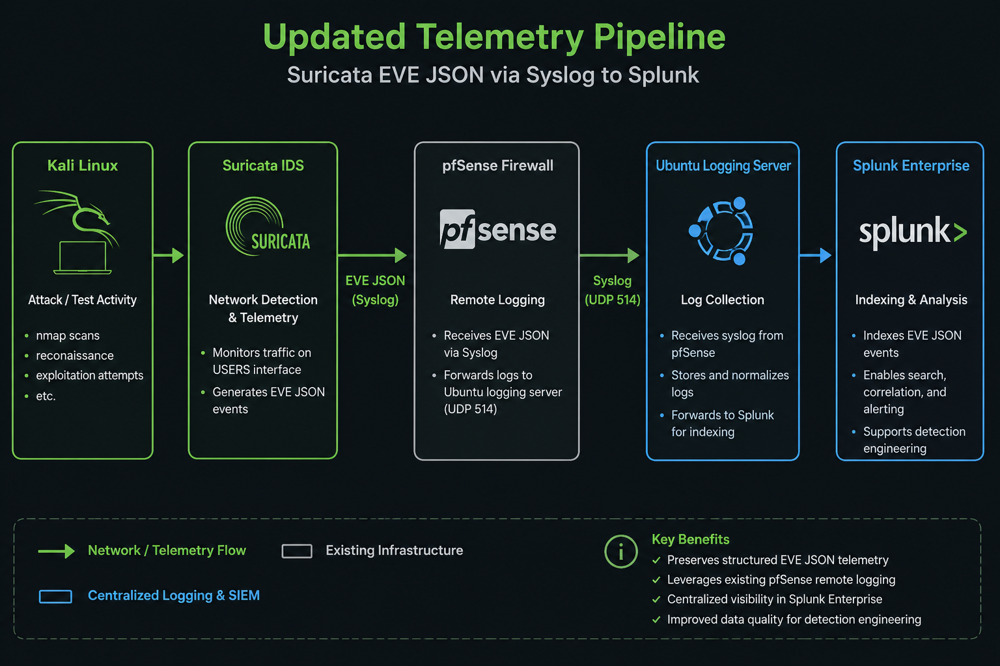

<!--
README Template

Guidelines

- Place screenshots in /screenshots
- Place diagrams in /diagrams
- Use one image per implementation step
- Keep Project Summary to 2–3 paragraphs
- Use sentence case for section descriptions
- Separate each major section with ---
- Keep Technologies Used limited to major technologies
- Future Use should focus on follow-on projects
-->

# Modernizing the Security Telemetry Pipeline

## Objective

Modernize the Suricata telemetry pipeline by replacing traditional syslog-style alert forwarding with structured EVE JSON telemetry. The project demonstrates how improving telemetry quality strengthens Splunk searching, detection engineering, and incident investigations without requiring major architectural changes.

---

## Technologies Used

- Splunk Enterprise
- Suricata IDS
- pfSense
- Kali Linux
- Secure Shell (SSH)
- Suricata EVE JSON
- Syslog

---

## Environment

| Component | Configuration |
|-----------|---------------|
| Firewall / IDS | pfSense with Suricata |
| SIEM | Splunk Enterprise |
| Attack Workstation | Kali Linux |
| Telemetry Format | Suricata EVE JSON |
| Primary Goal | Security Telemetry Modernization |

---

## Project Summary

This project focused on improving the quality of network telemetry available for detection engineering, security monitoring, and incident investigations. Rather than replacing an existing logging architecture, the project enhanced the telemetry generated by Suricata while preserving the established pfSense and Splunk infrastructure.

By replacing traditional syslog-style alerts with structured EVE JSON telemetry, Splunk received significantly richer event data containing additional network context. The improved telemetry provides a stronger foundation for future detections, threat hunting, alert development, and forensic investigations.

---

## Security Concepts Demonstrated

- Detection Engineering
- Security Telemetry
- Structured Logging
- Centralized Logging
- SIEM Architecture
- Pipeline Validation
- Telemetry Modernization

---

## Implemented Controls

- Enabled Secure Shell access to pfSense
- Validated remote administrative access
- Configured Suricata EVE JSON output
- Verified structured telemetry generation
- Forwarded structured telemetry through the existing logging pipeline
- Validated indexed events within Splunk
- Confirmed improved telemetry for future detection engineering

---

## Skills Demonstrated

- Splunk Administration
- Detection Engineering
- Suricata IDS
- pfSense Administration
- Secure Shell Administration
- Structured Telemetry Analysis
- Telemetry Validation
- Network Security Monitoring
- Technical Documentation

---

## Key Takeaways

- Improved telemetry quality without rebuilding the existing logging architecture
- Preserved the existing pfSense and Splunk infrastructure
- Enhanced network visibility using structured EVE JSON telemetry
- Validated each stage of the telemetry pipeline independently
- Established a stronger foundation for future detection engineering

---

## Validation

Validation included:

- Confirming Suricata generated EVE JSON telemetry
- Validating remote administrative access through SSH
- Generating network reconnaissance traffic from Kali Linux
- Confirming Suricata detected the activity
- Verifying telemetry was forwarded through the logging pipeline
- Confirming structured event data was indexed within Splunk

---

## Implementation Highlights

### Original Telemetry Pipeline

Before modernizing the telemetry pipeline, Suricata alerts were written to the pfSense system log and forwarded to Splunk through remote syslog. While functional, this approach did not preserve the rich structured telemetry available through Suricata's native EVE JSON output.

---

### Enabling Secure Shell Access

Secure Shell (SSH) was enabled on the pfSense firewall to provide secure remote administrative access. Command-line access simplified configuration validation, troubleshooting, and inspection of Suricata telemetry without relying solely on the web interface.

---

### Validating Remote Administration

After enabling SSH, connectivity was validated from the Windows management workstation. Successful authentication confirmed that the firewall could be securely administered from the command line.

---

### Configuring Suricata EVE JSON

Suricata was reconfigured to generate structured EVE JSON telemetry instead of relying solely on traditional syslog alerts. Structured events preserve significantly more investigative context while improving search and detection capabilities.

---

### Locating the EVE JSON Log

The pfSense file system was inspected to locate the active EVE JSON log generated by Suricata. Confirming the log location verified that structured telemetry was being produced successfully.

---

### Validating Structured Telemetry

Reviewing the EVE JSON output confirmed that Suricata was generating structured event data containing significantly more information than traditional syslog messages.

---

### Generating Network Activity

Network reconnaissance traffic was generated from the Kali Linux workstation to verify that Suricata continued detecting activity after the telemetry pipeline was modernized.

---

### Confirming Structured Events in Splunk

Structured EVE JSON telemetry successfully traversed the existing logging pipeline and was indexed by Splunk. The enriched events provide substantially more context for searching, alerting, and future detection engineering.

---

### Modernized Telemetry Pipeline

The completed telemetry pipeline now forwards structured Suricata EVE JSON events into Splunk while preserving the existing architecture. Richer telemetry provides improved visibility for security monitoring, threat hunting, and future engineering projects.

---

## Future Use

This modernized telemetry pipeline supports future projects involving:

- Security Monitoring
- Detection Engineering
- Threat Hunting
- Incident Response
- PCI DSS Monitoring
- Security Telemetry Analysis

---

## Related Blog Article

**Modernizing the Security Telemetry Pipeline**

https://hupfendynamics.com/blog/f/modernizing-the-security-telemetry-pipeline