# Building and Validating a PCI DSS-Inspired Security Operations Lab

## Objective

Design, build, and validate a PCI DSS-inspired security operations environment that demonstrates enterprise security concepts, including network segmentation, centralized logging, intrusion detection, detection engineering, automated alerting, and incident investigation. The project emphasizes validating security controls through controlled testing rather than simply deploying technologies.

---

## Technologies Used

- Kali Linux
- pfSense
- Splunk Enterprise
- Suricata IDS
- Ubuntu Server 24.04 LTS
- VMware Workstation Pro
- Windows 10 Pro

---

## Environment

| Component | Configuration |
|-----------|---------------|
| Hypervisor | VMware Workstation Pro |
| Firewall | pfSense |
| SIEM | Splunk Enterprise |
| Network IDS | Suricata IDS |
| Linux Server | Ubuntu Server 24.04 LTS |
| Windows Endpoints | Windows 10 Pro (Management & CDE) |
| Attack Workstation | Kali Linux |
| Primary Goal | Build and validate a PCI DSS-inspired security operations environment |

---

## Project Summary

This project demonstrates the design, implementation, and validation of a PCI DSS-inspired security operations lab built using enterprise security technologies. Rather than focusing solely on deploying individual tools, the environment was engineered to demonstrate how network segmentation, centralized logging, intrusion detection, and detection engineering operate together as an integrated security program.

The environment was organized into segmented USERS, MGMT, and CDE networks protected by pfSense. Security telemetry from Windows, Linux, and network infrastructure was centralized within Splunk Enterprise, while Suricata provided network intrusion detection using structured EVE JSON telemetry. Controlled attack simulation from a dedicated Kali Linux workstation validated each stage of the monitoring pipeline, culminating in automated detections, alert generation, and analyst investigation workflows.

Throughout the project, every major security control was deliberately exercised through controlled testing to verify that the environment operated as designed. This emphasis on validation demonstrates that effective security depends not only on implementing controls, but on proving they function correctly under realistic conditions.

---

## Architecture Overview

The security operations environment was designed using a layered architecture in which each component performs a specific role while contributing to a centralized monitoring and detection pipeline. Rather than relying on individual security tools operating independently, the project integrates network segmentation, firewall enforcement, endpoint telemetry, intrusion detection, centralized logging, and detection engineering into a cohesive security operations platform.

The following diagrams illustrate the progression from the underlying network architecture through telemetry collection, detection workflows, and analyst investigation. Together, they provide a high-level view of how security events move through the environment from initial activity to validated detections and operational response.

### Network Architecture

The environment is divided into dedicated USERS, MGMT, and CDE network segments protected by pfSense, establishing clear security boundaries while supporting centralized management and monitoring.

---

### Centralized Logging Architecture

Telemetry from Windows, Linux, pfSense, and Suricata is consolidated within Splunk Enterprise, providing centralized visibility for security monitoring, investigation, and event correlation.

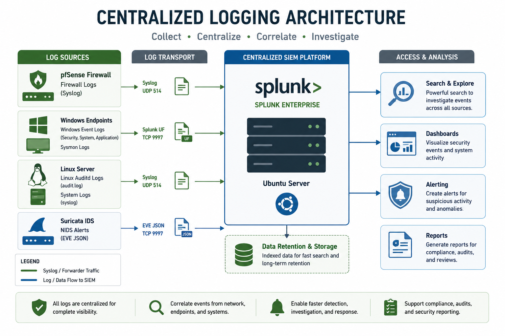

---

### Network Detection Architecture

Suricata monitors network traffic and generates structured EVE JSON telemetry, allowing network events to be correlated with endpoint and firewall logs within Splunk.

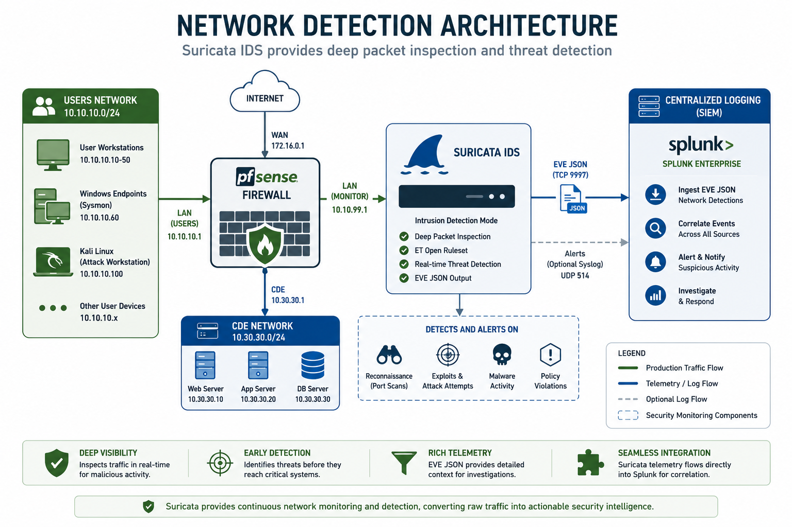

---

### Telemetry Validation Workflow

Controlled activity generated within the lab validates that security events are successfully collected, transported, indexed, and made available for investigation throughout the monitoring pipeline.

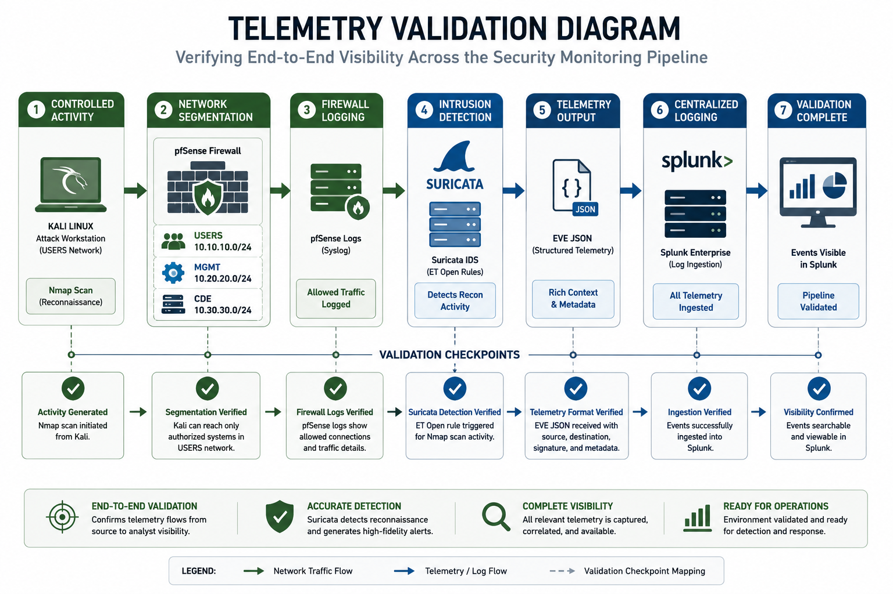

---

### Detection Workflow

Validated telemetry is transformed into repeatable Splunk detections and scheduled alerts, enabling analysts to identify and investigate suspicious activity through a structured detection engineering workflow.

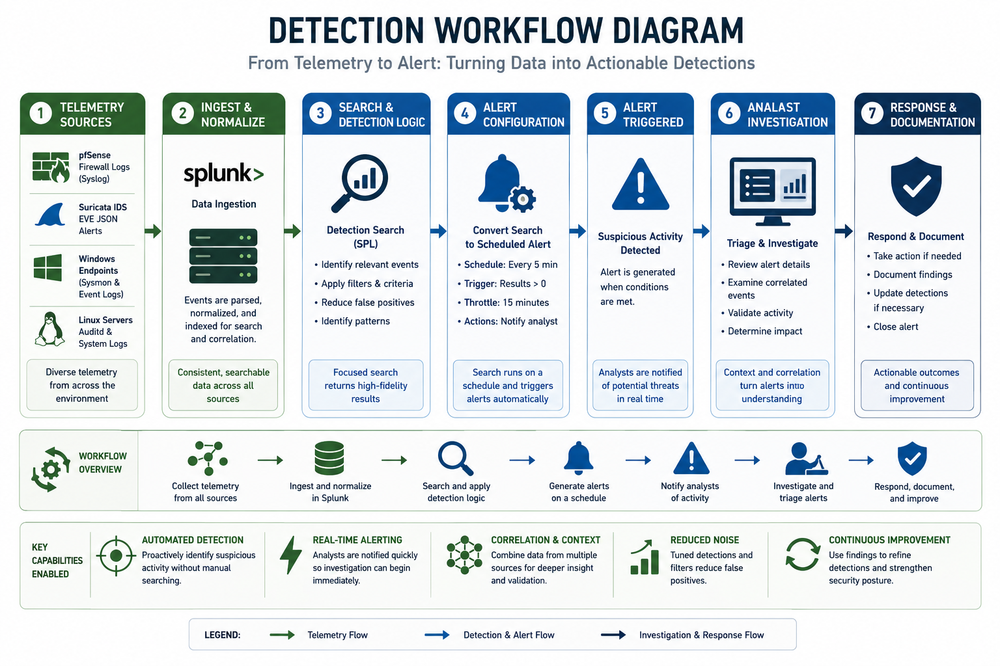

---

### Monitoring to Security Operations

The completed environment supports the full security operations lifecycle by combining monitoring, detection, alerting, investigation, and incident response into an integrated operational workflow.

---

## Security Concepts Demonstrated

- Centralized Logging
- Defense in Depth
- Detection Engineering
- Incident Investigation
- Intrusion Detection
- Network Segmentation
- Security Monitoring
- Security Telemetry
- SIEM Architecture
- Validation of Security Controls

---

## Implemented Controls

- Built segmented USERS, MGMT, and CDE network architecture
- Configured pfSense firewall and routing
- Deployed Splunk Enterprise for centralized log management
- Integrated Windows Event Logs, Sysmon, Linux, and pfSense telemetry
- Configured Suricata IDS using ET Open rules
- Enabled structured EVE JSON telemetry
- Developed and validated Splunk detections
- Implemented scheduled security alerts
- Correlated security events across multiple telemetry sources
- Performed end-to-end telemetry validation

---

## Skills Demonstrated

- Detection Engineering
- Linux Administration
- Network Architecture
- Network Security Monitoring
- pfSense Administration
- Security Architecture
- SIEM Administration
- Splunk Administration
- Suricata Administration
- Technical Documentation

---

## Key Takeaways

- Designed and validated a segmented enterprise-style security architecture
- Centralized telemetry from network and endpoint sources into a single SIEM
- Demonstrated end-to-end detection engineering from telemetry to alert
- Validated security controls through controlled attack simulation
- Established a reusable security operations platform for future projects

---

## Validation

Validation included:

- Confirming network segmentation between USERS, MGMT, and CDE
- Verifying centralized log collection within Splunk
- Validating Suricata network detections
- Generating controlled reconnaissance activity using Kali Linux
- Correlating events across pfSense, Suricata, Windows, and Linux telemetry
- Confirming scheduled Splunk alerts triggered successfully
- Verifying complete analyst investigation workflow

---

## Implementation Highlights

The following implementation highlights demonstrate how the architectural design was translated into a fully operational security operations environment. Each phase was validated before progressing to the next, ensuring that individual components and the complete monitoring pipeline functioned as intended.

### Building the Segmented Network Infrastructure

The environment was built around a segmented network architecture using pfSense to isolate user, management, and protected systems. Multiple virtual network adapters provided connectivity between the WAN, USERS, MGMT, and CDE networks while allowing pfSense to enforce routing and security policies.

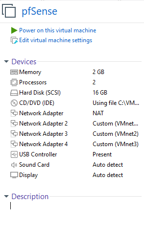

---

### Configuring Network Services

After the segmented architecture was established, pfSense was configured to provide essential network services for each security zone. DHCP services were enabled on the internal interfaces to ensure systems received the appropriate network configuration while remaining isolated within their designated segments.

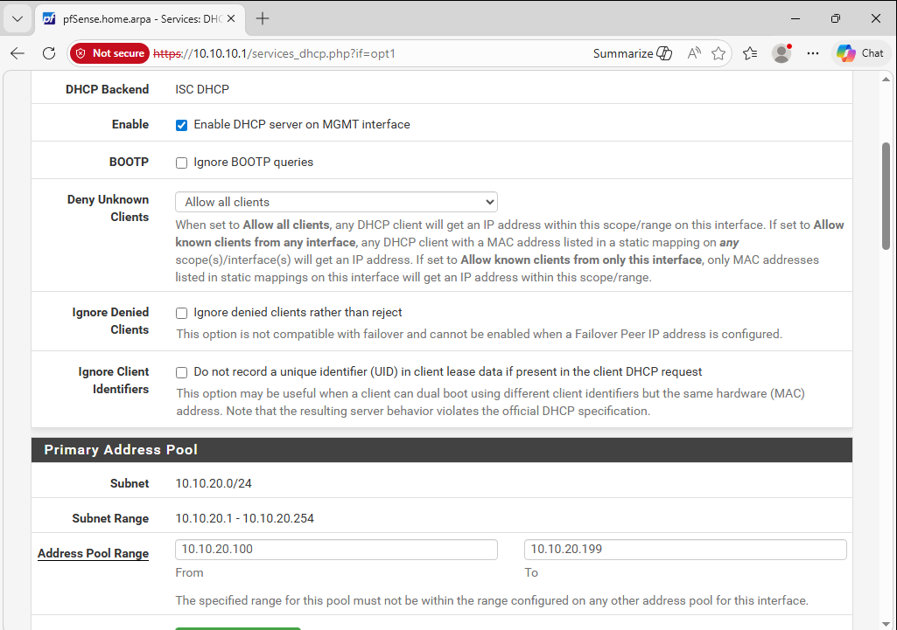

---

### Deploying Centralized Logging

Splunk Enterprise was deployed as the centralized SIEM for the environment. Once operational, Windows endpoint telemetry was successfully ingested and validated, establishing centralized visibility before additional detection capabilities were introduced.

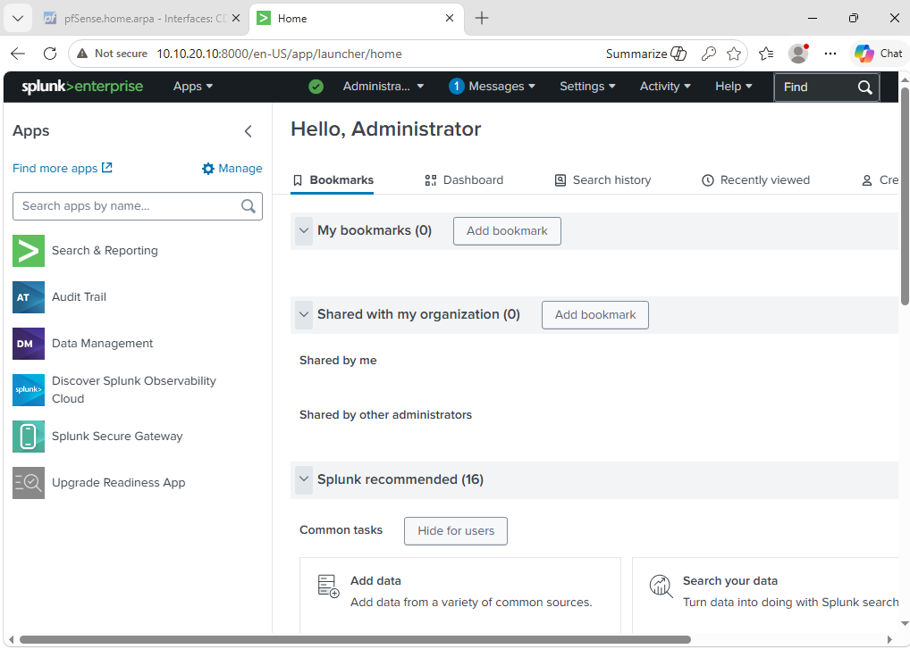

---

### Validating Endpoint Telemetry

Windows event logs were collected and indexed within Splunk to verify that endpoint telemetry was flowing correctly. Successful ingestion confirmed that the centralized logging pipeline was ready to support future detection engineering and incident investigations.

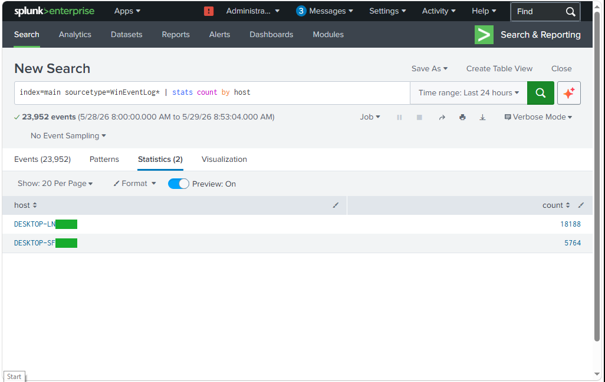

---

### Implementing Structured Network Telemetry

Suricata was configured to generate structured EVE JSON telemetry, providing significantly richer network event data than traditional syslog messages. This structured output improved searching, correlation, and future detection development.

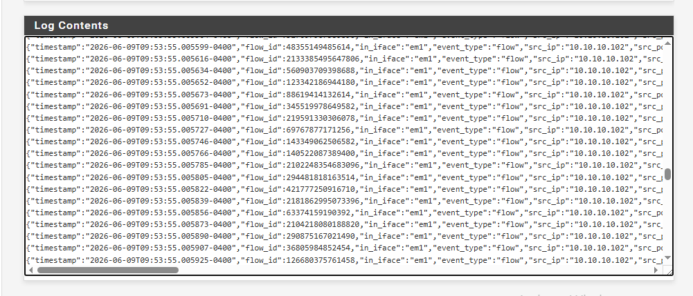

---

### Generating Controlled Attack Activity

Controlled reconnaissance traffic was generated from the Kali Linux workstation to validate the monitoring pipeline under realistic conditions. Simulated attack activity provided repeatable events for testing detection logic and alert generation.

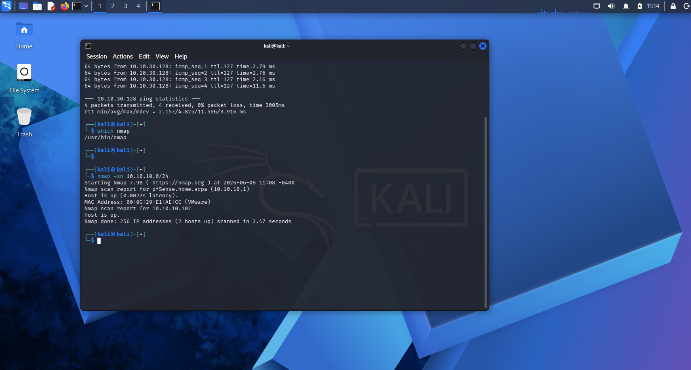

---

### Validating Network Detection

Suricata successfully detected the reconnaissance activity and generated alerts that were forwarded into Splunk for investigation. This confirmed the end-to-end monitoring pipeline from network activity through detection and analyst visibility.

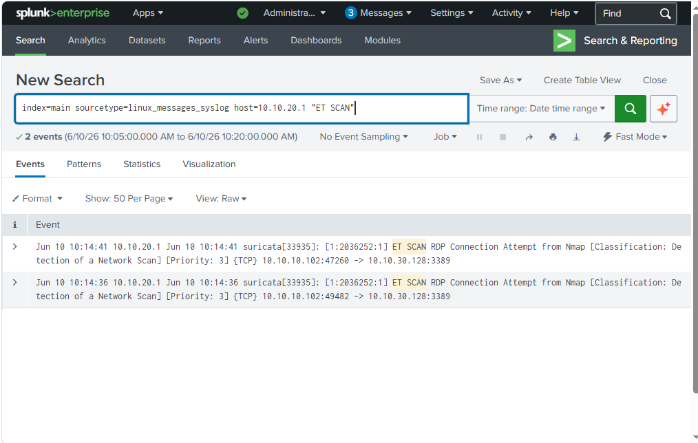

---

## Future Use

This project supports future work involving:

- Detection Engineering
- Incident Response
- Threat Hunting
- Vulnerability Management

---

## Related Blog Article

**Building and Validating a PCI DSS-Inspired Security Operations Lab**

[Read the article at Hupfen Dynamics](https://hupfendynamics.com/blog/f/pci-dss-inspired-security-operations-lab?blogcategory=Projects)