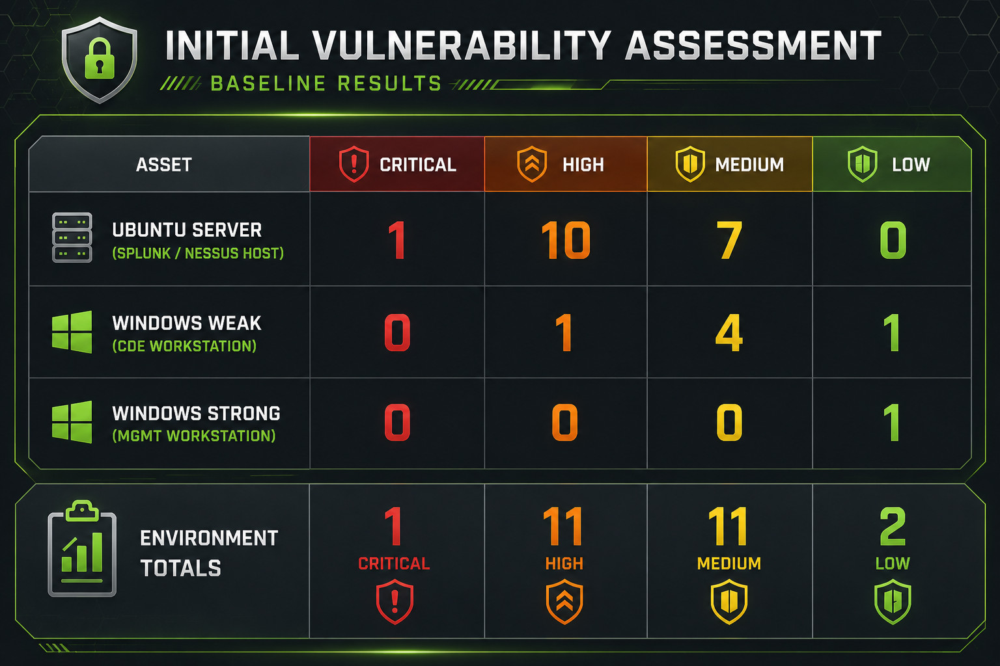
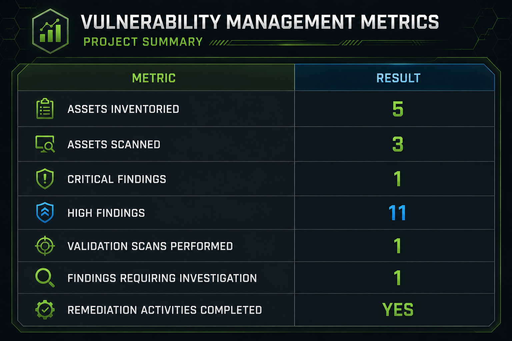
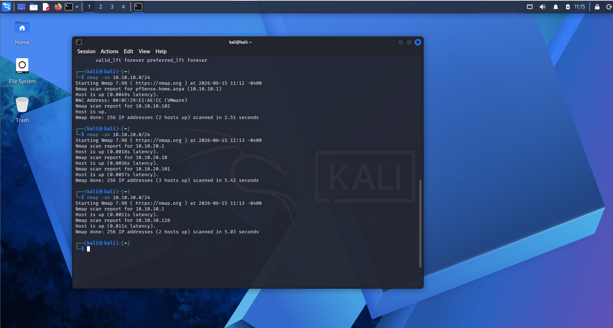
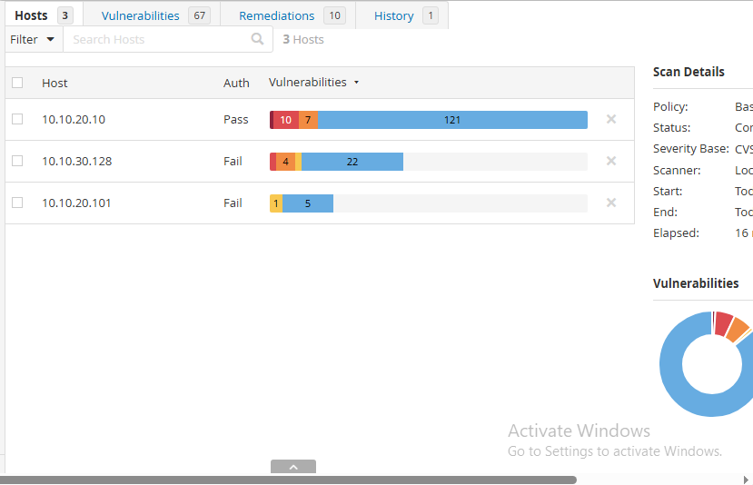
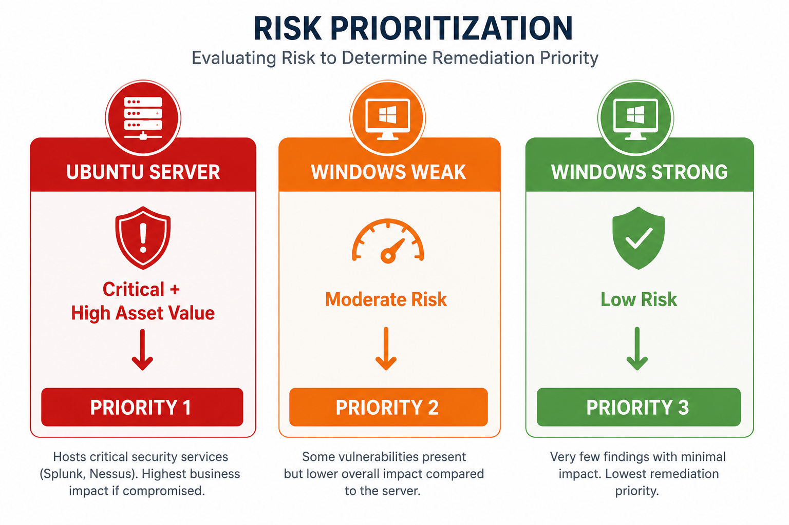
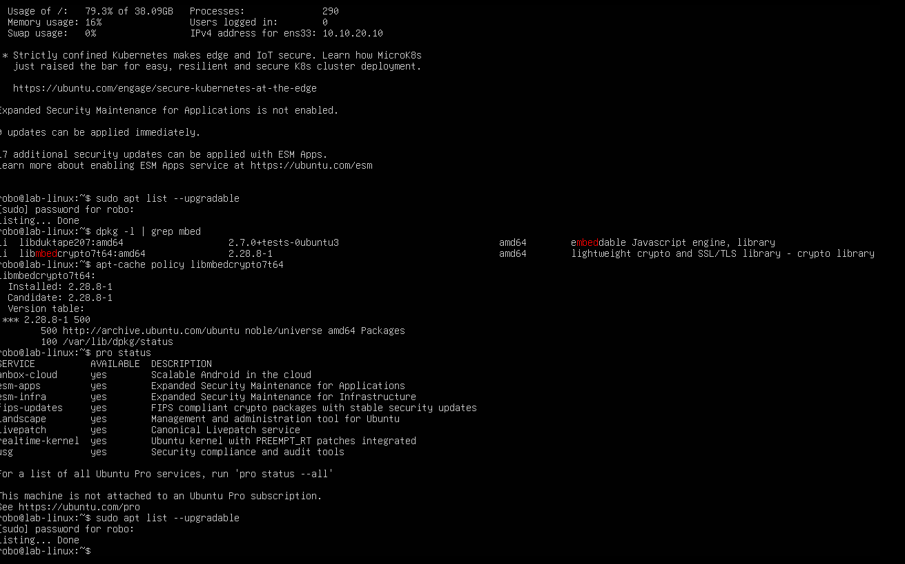

# Vulnerability Management Program

## Objective

Demonstrate the implementation of a complete vulnerability management lifecycle within a segmented network environment. This project showcases asset discovery, vulnerability assessment, risk-based prioritization, remediation, validation, investigation, and reporting using industry-standard methodologies representative of an enterprise vulnerability management program

---

## Technologies Used

- Kali Linux
- Nmap
- Nessus Essentials
- pfSense
- Ubuntu Server
- Windows 10

---

## Environment

| Component | Configuration |
|-----------|---------------|
| Vulnerability Scanner | Nessus Essentials |
| Discovery Tool | Nmap |
| Server Platform | Ubuntu Server 24.04 LTS |
| Client Systems | Windows 10 (Management & CDE) |
| Assessment Workstation | Kali Linux |
| Network Segmentation | pfSense Firewall |

---

## Project Summary

This project demonstrates the implementation of a complete vulnerability management program within a segmented network environment. Beginning with asset inventory and network discovery, the environment was assessed using Nessus Essentials to establish a baseline understanding of its security posture before vulnerabilities were prioritized according to operational risk.

Following remediation activities, the environment was re-evaluated through validation scanning and independent verification using native operating system tools. Rather than focusing solely on vulnerability scanning, the project demonstrates the complete lifecycle of identifying assets, evaluating risk, validating corrective actions, investigating unexpected findings, and communicating security posture through meaningful metrics and reporting.

---

## Project Overview

The following diagrams summarize the vulnerability management lifecycle, the baseline assessment results, and the project metrics established throughout the implementation.

### Vulnerability Assessment Results

---

### Vulnerability Management Metrics

---

## Security Concepts Demonstrated

- Asset discovery and inventory management
- Vulnerability assessment
- Risk-based vulnerability prioritization
- Remediation validation
- Security metrics and reporting

---

## Implemented Controls

- Asset inventory validation
- Network host discovery
- Baseline vulnerability assessment
- Risk-based remediation workflow
- Validation through follow-up assessments

---

## Skills Demonstrated

- Asset discovery and inventory validation
- Risk-based vulnerability analysis
- Remediation validation
- Vulnerability management
- Security reporting and documentation

---

## Key Takeaways

- Built a repeatable vulnerability management lifecycle
- Validated documented assets through network discovery
- Prioritized remediation using risk rather than severity alone
- Verified remediation through follow-up assessments
- Demonstrated investigation of persistent scanner findings

---

## Validation

Validation included:

- Asset inventory verification through Nmap host discovery
- Baseline vulnerability assessment using Nessus Essentials
- Operating system package verification using native Ubuntu tools
- Follow-up vulnerability assessment using identical scan parameters
- Investigation of persistent Critical findings through independent analysis

---

## Implementation Highlights

### Asset Discovery and Inventory Validation

Before performing vulnerability assessments, the documented asset inventory was validated through network discovery. Nmap host discovery scans were executed against each network segment to confirm that expected systems were present and to identify any discrepancies between the documented inventory and the live environment.

---

### Baseline Vulnerability Assessment

A non-credentialed Nessus Essentials scan was performed against the Ubuntu server and Windows workstations to establish the initial security posture of the environment. The host summary showed that the Ubuntu server contained the largest concentration of reported findings, establishing it as the highest remediation priority for the project.

---

### Risk Analysis and Remediation

Assessment results were evaluated using both vulnerability severity and operational context to determine remediation priorities. Because the Ubuntu server hosted critical security services, it was selected as the first remediation target despite the presence of findings on other systems. Native Ubuntu package management tools were then used to verify available updates before corrective actions were applied.

---

### Validation and Investigation

Following remediation, the environment was reassessed using the same Nessus scan configuration to ensure a consistent comparison with the baseline assessment. The follow-up scan showed that additional investigation was required, prompting independent verification using Ubuntu package management tools to determine why a Critical finding persisted after remediation.

---

## Future Use

This project supports future work involving:

- Continuous vulnerability management
- Detection engineering
- Security compliance initiatives
- Security operations workflows

---

## Related Blog Article

**Vulnerability Management Program**

[Read the article at Hupfen Dynamics](https://hupfendynamics.com/blog/f/vulnerability-management-program)